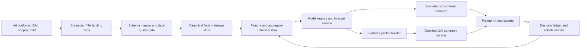

# Horizon: Enterprise Revenue Planning for E-commerce Media

## 1. Product thesis

**Horizon** is a decision-support product for NetElixir strategists and their e-commerce clients. It turns trusted Google Ads, Microsoft Ads, Meta, GA4, and Shopify data into **30-, 60-, and 90-day revenue and blended ROAS ranges**, explains the evidence behind the range, and lets a planner test a future media-budget plan before spending it.

The important distinction: Horizon does not pretend to know the future, does not replace platform attribution, and does not allow an LLM to invent an answer. It combines calibrated probabilistic forecasting, scenario-response modeling, data-quality controls, and an evidence-constrained explanation layer. A forecast is therefore a decision memo with numbers, confidence, assumptions, and a recommended next test - not a colorful dashboard or generic AI prose.

This design is **enterprise and public-sector deployable in architecture**, with private tenancy, auditability, retention controls, and no required outbound model call. It is not a claim of FedRAMP or any other certification; those require an authorization process and operating controls beyond a hackathon build.

## 2. The sponsor and why this problem matters

### Sponsor analysis: NetElixir

NetElixir positions itself as an AI-first growth marketing agency for mid-sized e-commerce brands. Its public materials emphasize profitable, predictable growth; stewardship of paid-media budgets; cross-channel work across paid search, paid social, and marketplaces; and its LXRInsights platform/service, which couples predictive customer intelligence with controlled experimentation. This challenge is therefore not asking for a generic forecasting toy. It is a chance to create a planning primitive that makes agency strategy more scalable, trustworthy, and measurable.

| NetElixir business objective | What Horizon supplies | Value mechanism | Proof an evaluator can see |
|---|---|---|---|
| Protect profitable growth and ROAS | P10/P50/P90 revenue and ROAS, probability of clearing a floor | Fewer budget plans are approved on an overconfident point estimate | A plan says, for example, "72% chance of blended ROAS >= 4.0" rather than claiming a guaranteed 4.3 |
| Differentiate proprietary AI and expert strategy | Evidence-backed forecasts plus human approval and experiment hand-off | A productized strategic service is harder to commoditize than reporting | Source-linked explanation, uncertainty calibration, and a decision ledger |
| Scale an agency team's planning capacity | Canonical cross-channel data, reusable model hierarchy, and exception queue | Less spreadsheet reconciliation and more time spent on client strategy | Before/after planning-cycle time and data-quality issue counts |
| Retain clients through measurable value | Forecast-versus-actual learning, guardrails, and a next-best-test backlog | Clients can see whether recommendations were reliable and why they changed | Rolling calibration dashboard and client-ready plan export |
| Grow LXRInsights and experiment services | Forecast identifies high-value budget decisions and only labels causal effects when test evidence exists | More qualified opportunities for controlled testing and activation | "Association only" versus "validated by experiment" badges with test designs |

NetElixir publicly describes LXRInsights as a combination of predictive intelligence and expert-led experimentation, evaluated through control-versus-test measurement rather than platform-reported results alone. Horizon should fit that operating model: forecast first, select a decision, then validate material recommendations with an experiment. [NetElixir Innovation Stack](https://www.netelixir.com/innovation)  
NetElixir also describes itself as the growth engine for mid-sized e-commerce brands and highlights responsible stewardship of ad dollars and ROAS. [NetElixir home page](https://www.netelixir.com/)

### High-value problem and ROI hypothesis

The problem is high value because a forecast changes where a client deploys a recurring paid-media budget. The commercial value is not the chart; it is a better capital-allocation decision and a more repeatable agency service.

Use this conservative ROI model in a pilot, with the numbers completed using client data rather than invented claims:

```text
Annual decision value = annual managed media spend x validated efficiency lift
Agency operating value = planning hours saved x fully loaded strategist cost
Client value = incremental contribution margin - incremental media spend - platform/service cost
```

Measure a baseline during the pilot: time to create a cross-channel plan, forecast error, interval coverage, percentage of plans that breach a client ROAS floor, and incremental profit from recommendations subsequently tested. Do not claim a revenue or ROAS lift until it is measured against a credible baseline or control.

## 3. Problem statement traceability and evaluation matrix

There is one selected problem statement: **Probabilistic Revenue Forecasting for E-commerce Marketing**. The matrix turns every required deliverable and judging category into a visible product artifact.

| Brief requirement / judging criterion | Product response | Evidence to ship or demo | Why it scores |
|---|---|---|---|
| Aggregate revenue forecast | 30/60/90-day P10, P50, P90 forecast for Google, Meta, and Microsoft/Bing, plus blended total | Forecast card, downloadable table, forecast ID | Directly satisfies the primary outcome without hiding uncertainty |
| Blended ROAS forecast | Forecast revenue and spend jointly; compute ROAS for every simulated draw, then report quantiles | ROAS fan/range and chance of clearing a client floor | Avoids the mathematically wrong practice of dividing independent median forecasts |
| Channel, campaign type, and campaign outputs | Hierarchical model and reconciliation provide all three levels | Drill-down with contribution and interval coverage | Gives an operator actionable levers, not only a top-line number |
| 30/60/90 aggregate planning | Direct multi-horizon targets and period-level outputs | Horizon selector; no daily forecast presented as the decision answer | Matches the brief's aggregate-period constraint |
| Future media budget input | Scenario planner with fixed-total, channel-shift, and growth cases | Budget slider/table, feasibility warning, delta from baseline | Converts forecasting into a budget decision |
| Cross-channel data and existing attribution | Canonical metric layer retains source and attribution label; it does not rebuild attribution | Data lineage drawer and source totals reconciliation | Respects the source-of-truth boundary |
| Campaign consistency validation | Data contract, schema mapping, unit checks, duplicate/gap detection, and a mapping-review queue | Import quality report with blocking and warning states | Solves a real agency failure mode before modeling starts |
| Probabilistic, technically sound forecast | Hierarchical dynamic model, rolling-origin validation, calibrated conformal intervals, block bootstrap | Backtest/calibration page and model card | Demonstrates uncertainty as measured reliability, not decoration |
| Practical relevance | Budget guardrails, target ROAS probability, plan comparison, and recommendation hand-off | A strategist can answer "What changes if Meta gets 15% more?" | Closely maps to a media-planning workflow |
| AI integration and causal summaries | LLM verbalizes a structured evidence packet; causal claims require a defined identification test | Insight card includes evidence, confidence, and causal-status badge | Useful AI without hallucinated causality |
| Product thinking | One decision flow: connect, validate, plan, compare, approve, learn | Guided workflow and saved decision ledger | Simpler than an analytics dashboard |
| Engineering quality | Versioned schema/model, reproducible batch runner, observability, RBAC, and automated tests | README, architecture, clean-run test, audit record | Makes the prototype credible beyond demo day |
| Required technical documentation | Model card, data contract, assumptions, limitations, and runbook | `docs/` package | Explicitly covers the brief's documentation requirement |
| Required architecture overview | Frontend, API, batch pipeline, model registry, LLM boundary | Diagram below | Directly satisfies the architecture deliverable |
| Required demo workflow | Ingest, validate, simulate, forecast, explain, export | Six-minute scripted walkthrough | Directly satisfies the demo deliverable |

## 4. Product experience

### Primary users

1. **NetElixir strategist** creates a defensible client media plan and identifies risks before the client meeting.
2. **Performance marketer** changes a channel or campaign-type budget and sees marginal revenue, ROAS risk, and delivery caveats.
3. **Client leader** reviews an approved plan in plain language, including what would falsify it.
4. **Analytics / model-risk owner** verifies data quality, forecast calibration, model version, and explanation provenance.

### The decision loop

1. Connect or upload source data and select the attribution source of truth.
2. Resolve blocking data-quality and campaign-mapping issues.
3. Set the planning period, baseline budget, target ROAS / revenue goal, and scenario constraints.
4. Compare baseline, conservative, and proposed budget plans as distributions - not a single number.
5. Inspect contribution, saturation, risks, and assumptions. Convert material recommendations into a controlled test when causal certainty is absent.
6. Approve the plan into a versioned decision ledger. Later, compare forecast with actuals and feed calibration monitoring.

### Features that make the product materially useful

| Capability | What it does | Decision it enables |
|---|---|---|
| Forecast confidence card | Displays P10/P50/P90 revenue, ROAS, chance of target attainment, and interval-width reason | Is this plan safe enough to approve? |
| Budget Ripple | Shows the incremental effect of each budget move, diminishing-return zone, and confidence degradation when extrapolating | Where should the next dollar go? |
| Forecast Reconciliation | Ensures campaign forecasts sum to campaign type, channel, and blended totals | Can finance trust the roll-up? |
| Decision Ledger | Stores inputs, data snapshot, model version, forecast, approver, and eventual actual | What did we decide, on what evidence, and did it work? |
| Causal Evidence Panel | Separates observed association, quasi-experimental evidence, and randomized-test evidence | Should we change budget now or test first? |
| Explainable Anomaly Timeline | Identifies revenue/spend/ROAS breaks and attaches source events, missing-data warnings, and evidence IDs | Is this movement a real performance issue or bad data? |
| What Changed Since Last Plan | Highlights changes driven by spend, mix, seasonality, performance drift, or data revision | How should the client narrative change? |

## 5. Data foundation and governance

### Canonical daily input model

The enterprise product accepts daily campaign facts, but produces **aggregate planning-period** forecasts. It keeps raw source fields immutable and materializes a canonical record:

```text
tenant_id, source_system, source_campaign_id, canonical_campaign_id,
date, channel, campaign_type, campaign_name, spend, revenue,
clicks, impressions, conversions, configured_budget, currency,
attribution_label, source_file_hash, mapping_confidence, quality_flags
```

The supplied sample has 25,562 campaign-day records: 19,272 Google Ads rows, 3,417 Meta rows, and 2,873 Microsoft/Bing rows; 92, 16, and 28 campaigns respectively. It spans 2024-01-01 through 2026-06-05. Google spend is supplied in micros and must be divided by 1,000,000. The sample has missing Google and Meta budget fields, and Meta has no explicit campaign-type field. These are data-contract issues, not details to silently "fix."

### Import checks

**Block the run** for unreadable files, missing required fields, invalid dates, non-numeric metrics, duplicated source-key/date facts, negative spend/revenue, unit ambiguity, impossible `revenue > 0` with an explicitly zero conversion policy if that violates the client's definition, or no history for the selected horizon.

**Warn and flag** for missing dates, newly renamed campaigns, missing configured budgets, Meta campaign-type inference from a name, sudden metric discontinuity, attribution-label change, low delivery versus planned budget, or a scenario beyond the historical spend envelope. A planner may override a warning only with a reason captured in the ledger.

### Attribution and metric rules

* Existing channel attribution is preserved as the source of truth. Horizon is not an attribution engine or a full media-mix model.
* Define revenue semantic mapping once per tenant. In the sample, use Google `metrics_conversions_value` and Bing `Revenue`; treat Meta `conversion` as revenue only after the dataset owner confirms that definition. Otherwise label it `attributed_conversion_value_pending` and exclude it from a revenue total.
* Use `ROAS = attributed revenue / delivered spend`, calculated from period totals or each simulation draw. Never average campaign ROAS or average daily ROAS.
* Store currency and conversion-window metadata. A blend with mixed currency or attribution windows is blocked.

### Data protection and enterprise controls

Minimize inputs to campaign-performance facts; exclude customer PII by default. Encrypt raw and curated data in transit and at rest, tenant-isolate storage and compute, enforce SSO/SAML/OIDC and role-based access, record immutable audit events, set retention/deletion policies, scan uploads for secrets, and use per-tenant keys where required. A government deployment would additionally need a customer-approved region, identity federation, records policy, accessibility review, and an authorization boundary. None of these are substituted by an LLM privacy promise.

## 6. Forecasting and scenario methodology

### Model design

Use a **hierarchical, direct multi-horizon probabilistic model**. A direct 30/60/90-day target avoids presenting a sum of fragile daily point forecasts as an aggregate plan. The hierarchy borrows strength from campaign type and channel when a campaign is sparse, while allowing mature campaigns to retain their own history.

For each campaign and horizon, model delivered spend, attributed revenue, and the revenue response to budget:

```text
log(1 + revenue_h) = campaign_level
                    + channel x campaign-type partial pooling
                    + smooth(log(1 + delivered_spend_h))
                    + seasonality(horizon, week-of-year, holiday/event flags)
                    + recent efficiency and trend features
                    + availability / data-quality effects
                    + correlated residual
```

The media term is monotonic and saturating (for example, a constrained spline or Hill curve), so the model cannot casually claim linear revenue from unlimited budget. Delivered spend is separately modeled from planned budget, allowing an under-delivery warning. Revenue is sampled from a zero-aware, heavy-tailed distribution; spend and revenue residuals are sampled together using campaign/channel residual blocks to preserve correlation. Every simulation produces revenue and spend, then derives ROAS. Reconcile draws bottom-up so campaign, type, channel, and blended totals agree.

### Uncertainty that deserves trust

Intervals combine parameter/posterior uncertainty, residual variation, hierarchy fallback uncertainty, forecast horizon uncertainty, data-quality flags, and budget-extrapolation penalty. Calibrate final P10/P90 (or P5/P95 in enterprise) intervals with rolling-origin conformal calibration by channel and horizon. Show the calibration result: "90% interval covered 88% of comparable historical windows" is more credible than an unsupported confidence band.

### Forecast validation and model selection

* Create rolling historical cutoffs. Never shuffle time-series rows.
* Compare a seasonal-naive baseline, regularized gradient-boosted quantile model, and the hierarchical dynamic model.
* Select by a scorecard: weighted quantile loss, weighted absolute percentage error on P50, 80%/90% interval coverage, interval sharpness, reconciliation error, and stability under budget perturbation.
* Promote a model only if it beats the baseline on the agreed objective and remains calibrated by major channel/horizon. Otherwise surface the baseline and say so.
* Freeze an approved model with feature schema, training window, seed, package lock, evaluation report, and model-card hash.

### Scenario engine

The planner supplies channel or campaign-type budgets and optional constraints:

* total budget fixed, capped, or flexible;
* channel and campaign-type min/max bounds;
* target ROAS floor, revenue goal, and risk tolerance;
* lock campaigns that cannot be changed; and
* calendar/merchandising events with a human-entered confidence level.

Optimize only within observed or policy-approved ranges. Above the historical range, label results **extrapolative**, widen intervals, show a delivery risk, and require strategist approval. Return a Pareto set rather than one magic "optimal" plan: maximum expected revenue, highest chance of clearing ROAS floor, and balanced plan. The objective is expected incremental contribution margin where margin data exists, not simply platform ROAS.

### Causal inference and LLM boundary

Forecasting produces conditional projections, not causal proof. Horizon uses an explicit causal ladder:

| Evidence status | Permitted language | Method / requirement |
|---|---|---|
| Observational association | "Associated with", "consistent with" | Time series, residual diagnostics, and documented confounders |
| Quasi-experimental evidence | "Estimated incremental effect" | Pre-registered design, overlap checks, parallel-trend / placebo diagnostics; e.g. difference-in-differences or synthetic control |
| Randomized evidence | "Validated incremental lift" | Channel/campaign geo, audience, or holdout experiment with analysis plan |

The LLM receives only a structured evidence packet: forecast numbers, interval, model/feature diagnostics, anomaly facts, approved business glossary, causal status, and citations. It may summarize and propose questions; it cannot alter numbers, fabricate a cause, call a source it was not given, or execute an action. Outputs use a schema and include `evidence_ids`, `causal_status`, `assumptions`, and `recommended_validation`. High-impact insight text is reviewable and retained with its prompt/model version.

## 7. Reference architecture



| Layer | Production recommendation | Reason |
|---|---|---|
| UI | TypeScript/React or Next.js, accessible component system, chart rendering from server values | Fast strategist workflow; no calculations hidden in the browser |
| API | Python FastAPI, typed request/response contracts, asynchronous job queue | Shares validation and model code with batch scoring |
| Data | Object storage for immutable uploads, Postgres for metadata/ledger, warehouse or lakehouse for curated facts | Separates raw provenance from queryable planning data |
| Compute | Containerized Python workers; batch model runs plus low-latency scenario service | Scale by tenant/portfolio without coupling UI to training |
| Modeling | Versioned scikit-learn/PyMC or equivalent artifacts, MLflow-compatible registry, reproducible feature package | Auditable promotion and rollback |
| AI | Approved enterprise LLM gateway or self-hosted model, JSON schema output, redaction and policy checks | Explanation is governed, optional, and replaceable |
| Security | Tenant boundary, KMS, SSO/RBAC, audit log, WAF/rate limit, secret manager | Suitable foundation for regulated customers |
| Observability | Data-quality metrics, job traces, forecast/calibration metrics, alerts | Reliability is visible before clients are affected |

### Scale and reliability targets

Start with one tenant and daily batch ingestion, then horizontally scale stateless API/worker replicas and partition facts by tenant/date. A reasonable production SLO proposal is: 99.9% planner/API availability, 95% scenario responses under 5 seconds for a typical portfolio, batch data-quality result within 15 minutes of upload, and an auditable forecast record for every approved plan. Set capacity using measured portfolio size rather than invented claims; performance-test at 10x the largest expected tenant before launch.

## 8. Delivery roadmap

| Phase | Scope | Exit criteria |
|---|---|---|
| 0. Data and decision discovery | Confirm metric semantics, planning cadence, client ROAS rules, campaign taxonomy, and source access | Signed data dictionary and pilot success metrics |
| 1. Trusted forecast MVP | CSV ingestion, canonical schema, validation report, 30/60/90 quantiles, budget scenario, structured explanation | Rolling backtest, reproducible run, strategist can complete a plan end to end |
| 2. Pilot with one portfolio | Live read-only connectors, decision ledger, forecast-versus-actual monitor, analyst review workflow | Four to eight planning cycles measured against baseline |
| 3. Enterprise hardening | SSO, tenancy, full audit, retention, model registry, monitoring, approval workflow | Security and operational readiness review passed |
| 4. Scaled service | Multi-tenant onboarding, experiment hand-off, profit/margin objective, client exports/API | Repeatable commercial packaging and validated ROI |

## 9. Risks, limitations, and honest mitigations

| Risk / limitation | Product behavior | Mitigation |
|---|---|---|
| Historical attribution is incomplete or changes | Forecast carries source/attribution label and quality flag | Reconcile totals; do not blend incompatible windows; monitor revisions |
| Budget changes are observational, not randomized | No causal claim from a scenario alone | Use causal ladder and recommend a holdout/geo/audience test for material changes |
| New campaign has little history | Wider interval and hierarchy fallback label | Start at campaign type/channel prior; ask for planner priors; do not overfit |
| Promotions, stockouts, pricing, or creative changes absent from data | Assumption is explicit and uncertainty widens | Add event/availability inputs and evaluate their reliability |
| Response curves extrapolate | Scenario shows "outside observed range" | Cap recommendations or route to controlled test |
| LLM gives plausible but wrong prose | Numbers are locked and evidence IDs visible | JSON schema, policy checks, deterministic fallback templates, human approval |
| Forecast looks accurate only in aggregate | Backtest at campaign/type/channel and report calibration slices | Do not hide poor segment performance behind blended accuracy |

## 10. Definition of a winning enterprise outcome

Horizon earns trust when a strategist can answer, in under ten minutes:

1. What revenue and ROAS range does this exact 60-day plan imply?
2. What is the probability that it clears the client's ROAS floor?
3. Which three budget moves create the value, and where do returns start to diminish?
4. Which facts, assumptions, and model version support the answer?
5. Is this a forecast, an observational hypothesis, or a validated causal result?
6. What would we test next, and how will we know whether it worked?

That is a credible product extension for an AI-first e-commerce growth agency: disciplined prediction plus accountable execution, rather than AI-generated commentary over a spreadsheet.
