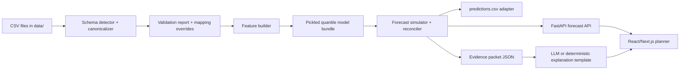

# Horizon MVP: Judge-Ready Build and Demo Plan

> **Document status — design target.** This plan records the intended judge-facing MVP, not a claim that every architecture/model choice below is shipped. The submitted evaluator artifact currently uses deterministic direct ridge models with chronological holdout residual quantiles. See [`current_implementation.md`](current_implementation.md) for the implementation truth and known limits.

## 1. MVP promise

Build **Horizon MVP**, a working forecasting utility that a NetElixir strategist can use to upload the three supplied channel CSVs, validate their differences, set a 30/60/90-day media plan, receive calibrated revenue and blended ROAS ranges at channel/campaign-type/campaign level, and read an evidence-backed AI decision brief.

The MVP is intentionally ambitious in experience but disciplined in scope:

* A real, deterministic Python prediction runner satisfies the automated scoring contract.
* A polished web app demonstrates decision-making, budget simulation, model reliability, and explanation quality.
* An LLM is optional for the UI and never required by `run.sh`; the scoring pipeline must work with no network access.
* The demo treats existing channel attribution as truth and does **not** build a custom attribution engine or a pretend causal model.

## 2. The judge-facing story

"A media plan is currently a spreadsheet promise. Horizon converts it into a quantified decision: what might happen, how uncertain it is, why, what budget is safe to move, and what experiment should validate the bet."

The wow moment is not a chatbot. It is showing a planner move budget from a saturated campaign type to a higher-confidence opportunity and immediately see:

* P10/P50/P90 revenue and blended ROAS change together;
* the probability of clearing a client ROAS guardrail;
* an extrapolation warning if the proposal leaves historical support;
* a reconciled channel-to-campaign explanation; and
* a concise insight which states whether the evidence is association or validated incrementality.

## 3. Success criteria and non-goals

### Definition of done

| Area | Acceptance criterion |
|---|---|
| Data ingestion | The three provided files load dynamically by schema pattern, not fixed filename; source mappings and unit conversions are visible |
| Validation | Blocking errors and non-blocking warnings are shown before a forecast can be generated |
| Forecast | 30/60/90-day P10/P50/P90 revenue and ROAS, plus channel, type, and campaign contributions, are reconciled |
| Scenario | A user changes budgets and receives a new forecast, delta, ROAS-floor probability, and support/extrapolation status |
| AI assistance | Structured evidence is rendered into a sourced decision brief, with a deterministic fallback if no key is configured |
| Reliability | Backtest view reports P50 error, pinball loss, and empirical interval coverage by horizon/channel |
| Submission | A clean clone can run `./run.sh DATA_DIR MODEL_PATH OUTPUT_PATH` with no prompts, absolute paths, or network calls |

### Deliberately out of scope

No custom attribution, multi-touch MMM, automated ad-platform writes, real-time streaming, user-level audience data, live bid optimization, or claim that a correlation is causal. These would dilute the core brief and undermine trust.

## 4. Supplied-data implementation facts

Use the data rather than treating it as a generic CSV exercise.

| Source | File / fields | Canonical conversion | Known issue to surface |
|---|---|---|---|
| Microsoft/Bing | `CampaignId`, `TimePeriod`, `Revenue`, `Spend`, `CampaignType`, `DailyBudget` | `Revenue -> revenue`, `Spend -> spend`, type available | Campaign ID field casing differs from Google/Meta |
| Google Ads | `campaign_id`, `segments_date`, `metrics_conversions_value`, `metrics_cost_micros`, `campaign_advertising_channel_type`, `campaign_budget_amount` | Spend is `metrics_cost_micros / 1_000_000`; conversion value is revenue | 14 budget values are missing; not all channel types are comparable without mapping |
| Meta | `campaign_id`, `date_start`, `conversion`, `spend`, `daily_budget`, `campaign_name` | Treat `conversion` as attributed revenue only after a mapping confirmation | No explicit campaign type; 7 budgets are missing |

The supplied archive contains 25,562 campaign-day records across 136 campaigns, from 2024-01-01 to 2026-06-05. The three source totals imply a provisional attributed-revenue total of 11,095,456.29 and spend of 2,181,943.02 (blended ROAS 5.085) only if Meta `conversion` is confirmed to be a revenue value. Put the word **provisional** next to that mapping in the UI and README; this is the kind of operational honesty judges notice.

## 5. MVP architecture



### Recommended stack

| Part | Technology | Rationale |
|---|---|---|
| Deterministic runner | Python 3.11, pandas, numpy, scikit-learn, joblib | Portable, familiar, pickle-compatible |
| Forecast model | Quantile Gradient Boosting / HistGradientBoosting model bundle plus residual calibration | Strong non-linear baseline that is feasible in hackathon time |
| API | FastAPI + Pydantic | Typed contracts shared with testable prediction functions |
| UI | React + TypeScript + Vite or Next.js, Tailwind, Recharts/Plotly | Fast, high-quality decision interface |
| Persistence for demo | Local SQLite/JSON forecast snapshots; later Postgres | No infrastructure dependency for judging |
| Optional LLM | Server-side structured-output call behind feature flag | Good narrative when online; deterministic template always works |
| Deployment | Docker Compose for demo convenience, but plain Python runner remains the authoritative submission path | Keeps UI separate from automated evaluator risk |

Pin all Python dependency versions in `requirements.txt`. The model bundle and the installed scikit-learn version must match exactly.

## 6. Forecasting design for the MVP

### 6.1 Canonicalization and features

Convert every source into the canonical columns `date`, `channel`, `campaign_id`, `campaign_name`, `campaign_type`, `spend`, `revenue`, `clicks`, `impressions`, `conversions`, and `configured_budget`. Preserve `source_system`, original IDs, and `quality_flags` outside the model features.

Create direct aggregate-horizon training examples at each historical cutoff. For a 30-day example, features available at the cutoff predict the **next 30-day total** revenue and spend; repeat for 60 and 90. This honors the brief's aggregate-forecast requirement rather than pretending daily output is the product answer.

Feature set:

* Channel, campaign type, stable campaign ID/name mapping;
* horizon indicator (30/60/90);
* trailing 7/28/56-day spend, revenue, ROAS, clicks, conversions, and volatility;
* trailing trend slope and change versus prior window;
* calendar seasonality using month, week-of-year, Fourier terms, and known promo flags if supplied;
* planned future budget, delta from recent delivered spend, and historical-spend percentile;
* data-completeness, missing-budget, new-campaign, and inferred-type flags.

### 6.2 Model bundle

Train separate lower, median, and upper quantile regressors for future aggregate revenue and delivered spend. Keep all preprocessing inside a serialized scikit-learn `Pipeline`/bundle. A per-channel/type median baseline is retained as a fallback for sparse groups.

At scenario time:

1. Validate requested budgets and derive scenario features.
2. Produce P10/P50/P90 revenue and spend for each leaf campaign/horizon.
3. Apply a conservative monotonic response multiplier derived from historical spend elasticity. Clamp the response at the historical support boundary; mark beyond-boundary scenarios as extrapolative and widen the interval.
4. Sample 1,000 monotonic, ordered draws between calibrated quantiles. For each draw, calculate `ROAS = revenue / max(spend, epsilon)`.
5. Sum the same simulation draw across leaves, then calculate channel/type/blended ROAS. This makes every roll-up internally consistent.
6. Return P10/P50/P90, probability of target ROAS, contributions, deltas, flags, and model metadata.

Never calculate blended ROAS by averaging individual ROAS values. Never state a budget effect is causal from this observational dataset.

### 6.3 Backtesting and calibration

Use rolling-origin cuts with a 30-, 60-, and 90-day holdout, no random shuffle. Display:

* WAPE (or MAE) for the median forecast;
* quantile/pinball loss for P10/P50/P90;
* empirical 80% interval coverage and mean interval width;
* results by channel and by forecast horizon; and
* comparison with seasonal-naive / recent-period baseline.

Calibrate intervals using residual quantiles from prior rolling-origin windows. If P10/P90 coverage is poor, widen them rather than inventing certainty. A calibration score is a more impressive engineering artifact than a deceptively narrow fan chart.

## 7. Product screens and interaction design

### Screen A - Connect and validate

Drag in CSVs or use the repository `data/` folder. Show source cards, schema mapping, date coverage, row/campaign count, currency, and conversion/revenue mapping. The **Data Health Gate** reports blockers versus warnings and requires a mapping override for Meta campaign type / metric semantics.

### Screen B - Plan canvas

Select 30/60/90 days, a baseline or named plan, total budget, ROAS floor, and risk preference. Present a table for channel and campaign-type budgets, showing historical range and delivered-spend rate. A "rebalance" button proposes three named alternatives: Revenue First, ROAS Guardrail, and Balanced. These are recommendations, not invisible automatic actions.

### Screen C - Forecast decision card

Show revenue P10/P50/P90, blended ROAS P10/P50/P90, and `Pr(ROAS >= target)`. Use a scenario comparison waterfall: planned budget delta -> expected revenue delta -> risk delta. The decision text should be simple: "Balanced plan has +8.1% expected revenue, but only 61% probability of satisfying the 4.5 ROAS floor."

### Screen D - Contribution and diminishing returns

Drill from total to channel, campaign type, campaign. Each row shows budget, P50 revenue, P10-P90 range, P50 ROAS, delta versus baseline, contribution share, forecast-support status, and a small saturation curve. Click a row to see source lineage and its evidence.

### Screen E - Evidence Brief

Render an AI-assisted summary from structured facts:

```text
Decision: approve / revise / test
Forecast: exact P10/P50/P90 values and target probability
Top drivers: ranked, numeric contributions
Risks: missing data, extrapolation, wide interval, low delivery likelihood
Causal status: association / quasi-experimental / randomized
Recommended validation: a concrete holdout or geo/audience test
Evidence: forecast ID, source data window, model version, quality flags
```

Show the raw evidence JSON in a collapsible "How this was generated" panel. This prevents an LLM paragraph from looking like unsupported magic.

### Screen F - Trust center

Show rolling backtest coverage, model version, training window, feature list, data-quality log, and a saved plan/forecast ID. A visible `Forecast vs actual` placeholder communicates the intended learning loop even if the sample lacks future actuals.

## 8. LLM implementation without AI slop

The LLM prompt must receive a JSON evidence packet, not raw CSVs. Require a JSON response schema with `headline`, `summary`, `drivers[]`, `risks[]`, `causal_status`, `recommended_test`, and `evidence_ids[]`. Reject output that includes numbers not present in the packet or uses forbidden causal words when status is `observational_association`.

Use a deterministic local template whenever the API key is unavailable, rate limited, or disabled. The explanation feature must never block a forecast or the evaluator's offline run. Keep secrets server-side and out of the browser/repository.

## 9. Repository contract for automated scoring

The guide makes the runner a hard gate. Build this structure exactly:

```text
.
├── run.sh
├── requirements.txt
├── data/
│   └── sample source CSVs
├── pickle/
│   └── model.pkl
├── src/
│   ├── config.py
│   ├── ingest.py
│   ├── validate.py
│   ├── canonicalize.py
│   ├── features.py
│   ├── train.py
│   ├── predict.py
│   ├── forecast.py
│   └── output_adapter.py
├── tests/
│   ├── test_schema.py
│   ├── test_units.py
│   ├── test_runner_contract.py
│   └── test_reconciliation.py
├── app/                       # optional UI/API, not used by runner
├── README.md
└── docs/
```

`run.sh` must accept the three positional arguments and sensible defaults, create the output directory, find CSVs dynamically, generate features from whichever files were placed in `DATA_DIR`, load the specified pickle, and freshly write to `OUTPUT_PATH`.

```bash
#!/usr/bin/env bash
set -euo pipefail

DATA_DIR="${1:-./data}"
MODEL_PATH="${2:-./pickle/model.pkl}"
OUTPUT_PATH="${3:-./output/predictions.csv}"

mkdir -p "$(dirname "$OUTPUT_PATH")"
python src/predict.py \
  --data-dir "$DATA_DIR" \
  --model "$MODEL_PATH" \
  --output "$OUTPUT_PATH"
```

Do not decide final prediction columns until the launch's output schema is known. Encapsulate them in `output_adapter.py`; it should map the model's canonical forecast table to the announced format and validate exact column names/order/dtypes before writing. A perfectly good model with the wrong CSV layout scores zero.

### Clean-run verification protocol

1. Copy the repository to a fresh directory or fresh clone.
2. Create a clean Python 3.11 virtual environment and install only pinned `requirements.txt` dependencies.
3. Replace `data/` with a fixture containing renamed-but-schema-compatible files and a different row count.
4. Run `bash run.sh ./data ./pickle/model.pkl ./output/predictions.csv` with network disabled.
5. Assert the CSV exists, is fresh, has the announced exact schema, has no invalid numeric values, and reconciles as intended.
6. Repeat with an intentionally bad input and confirm a loud, descriptive failure.

## 10. 36-hour build sequence (critical path first)

The deadline in the brief is July 19, 2026 at 10:00 PM IST, so build the submission gate before visual polish.

| Order | Work item | Time-box | Demonstrable outcome |
|---|---|---:|---|
| 1 | Scaffold repo, pinned environment, data loader, and `run.sh` | 2 h | Clean runner accepts dynamic directory and writes a placeholder valid CSV |
| 2 | Canonical mapper and data-health report | 3 h | Google micros conversion, Meta mapping warning, missing-budget flags, no silent assumptions |
| 3 | Direct-horizon features, train script, pickle bundle, output adapter | 5 h | Offline P50 prediction pipeline and schema contract test |
| 4 | Quantile forecasts, simulation/reconciliation, rolling backtest | 5 h | P10/P50/P90 and reliable comparison with baseline |
| 5 | FastAPI endpoints and scenario contract | 3 h | Scenario can be invoked by API and saved as JSON |
| 6 | Planner UI: validation, budget canvas, forecast card, contribution view | 6 h | One polished end-to-end planner journey |
| 7 | Evidence brief, deterministic fallback, causal-status guardrails | 2 h | Insight is specific and cited to values/flags |
| 8 | Trust center, demo seed scenarios, screen recording, README | 3 h | Judges can reproduce and understand the result |
| 9 | Fresh-clone rehearsal and submission packaging | 3 h | `run.sh` pass, executable bit verified, public GitHub-ready |

### Cut order if time becomes tight

Keep, in order: runner contract, validation, P50 forecast, budget scenario, P10/P90 calibration, and clean demo path. Cut in this order: live LLM, optimizer, secondary charts, Docker, authentication, and dark-mode polish. Do not cut reproducibility, raw metric definitions, or the honest uncertainty/causal labels.

## 11. Six-minute judge demo script

| Time | Action | What to say |
|---:|---|---|
| 0:00-0:35 | Open Plan canvas | "Agencies must decide where to deploy budget before performance is known. Existing forecasts are manual, deterministic, and hard to defend." |
| 0:35-1:20 | Upload / show Data Health Gate | "We unify source formats but preserve attribution. Google cost micros are converted; Meta revenue semantics and inferred type are visible, not hidden." |
| 1:20-2:15 | Show baseline 60-day forecast | "This is a range and probability of success, not a promise: P10, P50, P90 revenue and blended ROAS come from coherent simulations." |
| 2:15-3:20 | Move budget / choose Balanced plan | "We move spend within historical support. The system quantifies revenue upside, ROAS risk, and flags proposals that extrapolate." |
| 3:20-4:15 | Drill into contribution/saturation | "The total reconciles to channels, types, and campaigns. This is where a strategist sees where marginal returns diminish." |
| 4:15-5:00 | Open Evidence Brief | "The AI summary cannot make up facts. It uses this evidence packet and distinguishes association from a validated causal effect. It recommends the test needed to earn causal confidence." |
| 5:00-5:35 | Open Trust center | "Here is rolling backtest coverage, model version, and the decision ledger. We measure whether our uncertainty is honest." |
| 5:35-6:00 | Show terminal / README result | "Most importantly, the product has a reproducible offline runner. The evaluator can replace data, run one command, and collect predictions without touching the UI." |

## 12. Submission and scoring checklist

| Requirement | Final check |
|---|---|
| Public GitHub repository | URL tested in an incognito browser / clean clone |
| `run.sh` at root and executable | `git update-index --chmod=+x run.sh` committed; also test `bash run.sh` |
| Argument contract | Defaults and all three explicit positional arguments work |
| Dynamic data ingestion | No absolute paths, hard-coded local filenames, or row-count assumptions |
| Pickled model | `pickle/model.pkl` committed, ordinary clone retrieves it, unpickles with pinned version |
| Dependencies | Every package has an exact version; Python version stated in README |
| Offline run | No LLM/API download, network call, interactive prompt, or notebook step |
| Exact output | Adapter validates launch-announced columns/order and overwrites output path fresh |
| Documentation | Method, assumptions, limitations, architecture, quick-start, and model card included |
| Demo | Screen recording has a no-network fallback and tells the decision story in six minutes |

## 13. Why this MVP can impress judges

The MVP meets every required output, but its differentiation is that it makes the difficult choices visible: schema/units are validated; revenue and ROAS uncertainty are statistically coherent; budget-response extrapolation is flagged; campaign-level detail reconciles to the executive number; and the LLM is accountable to evidence rather than filling the screen with fluent speculation.

That is exactly the type of utility NetElixir can evolve into a scalable client-planning and experimentation workflow: technically sound, operationally realistic, and easy for a strategist to defend in a client meeting.
