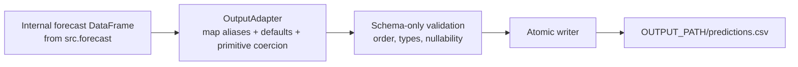

# `predictions.csv` Output Adapter Contract

## Purpose

[`src/output_adapter.py`](../../src/output_adapter.py) is the single serialization boundary for the protected submission path. It converts the inference pipeline's internal forecast `DataFrame` into the evaluator-facing `predictions.csv` and writes that file atomically.

It is intentionally an adapter, not a second forecasting pipeline. It does **not** train or load models, calculate forecasts, validate quantile ordering, infer hierarchy, call APIs, or apply marketing rules. Those concerns remain upstream. This separation makes a future evaluator-contract change a localized schema change instead of a risky model or runner rewrite.



## Ownership boundary

| Responsibility | Owner | Explicitly excluded from adapter |
| --- | --- | --- |
| Generate revenue, spend, ROAS, probability, and risk fields | Forecasting pipeline | Recalculation or semantic verification of values |
| Declare public column names, ordering, aliases, defaults, and scalar types | `OutputSchema` | Marketing/business semantics |
| Resolve internal field aliases and optional output defaults | `OutputAdapter.adapt` | Deriving required prediction values |
| Verify CSV shape and primitive values | `OutputAdapter.validate` | Quantile, attribution, or causal checks |
| Write a complete file or preserve the old file on failure | `OutputAdapter.write` | File discovery, input ingestion, or model loading |

`src.predict` invokes only `write_predictions_csv(...)`; it has no direct CSV-writing code. No other protected-path module should call `DataFrame.to_csv` for evaluator output.

## Current schema: `horizon-v1`

The current schema preserves the project's forecast output while keeping compatibility aliases for likely internal-name changes. Required fields fail closed when neither an alias nor an explicitly declared default exists. Defaults are used only for presentation fields where fabrication cannot alter a predicted value.

| Target column | Accepted internal aliases | Type | Default |
| --- | --- | --- | --- |
| `forecast_id` | `forecast_id`, `prediction_id` | string | Required |
| `horizon_days` | `horizon_days`, `horizon` | integer | Required |
| `level` | `level`, `hierarchy_level` | string | Required |
| `channel` | `channel`, `source_channel` | string | Required |
| `campaign_type` | `campaign_type`, `type` | string | Required |
| `campaign_id` | `campaign_id`, `source_campaign_id` | string | `ALL` |
| `campaign_name` | `campaign_name`, `source_campaign_name` | string | `ALL` |
| `planned_budget` | `planned_budget`, `planned_spend`, `budget` | number | Required |
| `predicted_revenue_p10/p50/p90` | respective `revenue_p*` aliases; P50 also `predicted_revenue` | number | Required |
| `predicted_spend_p10/p50/p90` | respective `spend_p*` aliases; P50 also `predicted_spend` | number | Required |
| `predicted_roas_p10/p50/p90` | respective `roas_p*` aliases; P50 also `predicted_roas` | number | Required |
| `probability_roas_above_target` | `probability_roas_above_target`, `roas_target_probability` | number | Required |
| `risk_score` | `risk_score`, `forecast_risk_score` | number | Required |
| `quality_flags` | `quality_flags`, `flags` | string | `none` |
| `model_version` | `model_version`, `artifact_version` | string | Required |

The organizers have not published a separate scorer header in the supplied guide. Horizon therefore **locks** on `horizon-v1` via this adapter and `product/tests/fixtures/horizon_v1_header.csv` until an official header is provided.

## Compatibility and versioning strategy

Schema versions are immutable declarations in `SCHEMA_REGISTRY`. The schema version is selected internally; the CSV receives no extra version column unless an evaluator explicitly requires one.

When the organizers publish a new contract:

1. Add a new `OutputSchema`, for example `EVALUATOR_V2_SCHEMA`, with its exact target names, ordering, aliases, scalar types, defaults, and sort keys.
2. Register it under a unique version string. Keep `horizon-v1` unchanged so old outputs remain reproducible.
3. Add fixture-based tests for the official sample input/output and negative cases.
4. Set `DEFAULT_SCHEMA_VERSION` only after those tests pass, or pass the version explicitly in a controlled release.
5. Run the exact offline `run.sh DATA_DIR MODEL_PATH OUTPUT_PATH` rehearsal and archive the resulting contract test report.

An evaluator schema change should normally modify only this module and its tests. If it asks for a value the internal forecast does not produce, the adapter fails with `SchemaAdaptationError`; do not invent a default for a predicted metric. That failure makes the required upstream product decision visible.

## Validation and failure behavior

The adapter validates only serialization-boundary invariants:

- exact column set and order;
- non-empty output for schemas that require it;
- declared primitive type (`string`, `integer`, or finite `number`);
- nullability; and
- internally well-formed schema declarations.

It reports deterministic, actionable errors:

| Condition | Error type | Behaviour |
| --- | --- | --- |
| Unknown schema version | `UnsupportedSchemaVersion` | Lists supported versions |
| Required source/alias absent | `SchemaAdaptationError` | Identifies target column and expected aliases |
| Null, non-numeric, non-finite, or fractional integer where invalid | `SchemaValidationError` | Identifies target column and rule |
| Wrong output order or columns | `SchemaValidationError` | Shows expected and received columns |
| Failure while writing | Original I/O exception | Removes temporary file; leaves prior destination intact |

Writing uses a same-directory temporary file followed by `Path.replace`. This prevents a partially written `predictions.csv` from appearing after a process interruption. Numeric fields serialize with the versioned fixed format `%.6f` and line endings are explicitly `\n`, eliminating harmless renderer differences across supported Python/NumPy builds without changing upstream forecast values. It is compatible with the evaluator's local, offline filesystem model. It is not a distributed transaction; a multi-writer production service would additionally serialize writes outside this module.

## Extension example

```python
EVALUATOR_V2_SCHEMA = OutputSchema(
    version="evaluator-2026-v2",
    fields=(
        OutputField("row_id", ("forecast_id",), "string"),
        OutputField("revenue_prediction", ("predicted_revenue_p50", "revenue_p50"), "number"),
        OutputField("submission_status", (), "string", default="ready"),
    ),
    sort_keys=("row_id",),
)

SCHEMA_REGISTRY = {
    V1_SCHEMA.version: V1_SCHEMA,
    EVALUATOR_V2_SCHEMA.version: EVALUATOR_V2_SCHEMA,
}
```

This is a data declaration: no change to model serialization, feature generation, or `run.sh` is required.

## Unit-test strategy

Tests live in [`product/tests/test_pipeline.py`](../tests/test_pipeline.py) because they are product-quality verification and must remain outside the protected evaluator path.

| Test category | Assertion |
| --- | --- |
| Golden V1 adaptation | Exact columns/order; all required values serialize without nulls |
| Alias compatibility | A legacy internal alias populates the documented target column |
| Optional fields | Missing `quality_flags` becomes `none`; missing required metric fails |
| Version isolation | A test-local `OutputSchema` maps a changed evaluator contract without global mutation |
| Invalid outputs | Missing columns, non-numeric values, nulls, and bad integer values produce `SchemaValidationError` |
| Atomic writer | A valid call produces the requested path; injected writer failure preserves a pre-existing file and removes its temporary file |
| Protected runner integration | `run.sh` produces a readable, schema-valid `predictions.csv` offline |

Before submission, add an official evaluator fixture test if and when an output template is supplied. The fixture must compare header order exactly and assert the required row key, row count, and numeric formatting rules from that template.

## Operational constraints

- Runtime dependencies are only Pandas and the Python standard library; no network client, UI, model SDK, or optional product module is imported.
- Input and output are DataFrames/filesystem paths only; adapter state is immutable per invocation.
- The adapter is `O(R x C)` for `R` rows and fixed schema width `C`, plus `O(R log R)` when the version declares sort keys. Current `C` is constant, so memory is linear in output rows.
- A schema is selected before data is adapted, making behavior reproducible and testable even as future versions are added.
