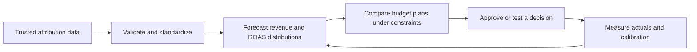
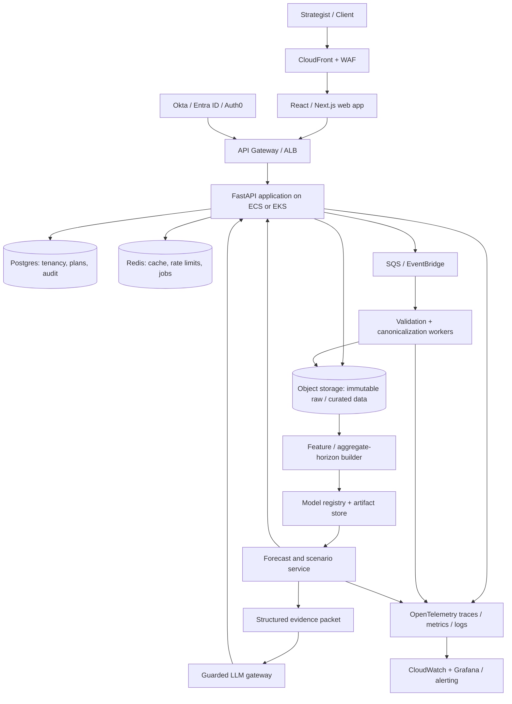
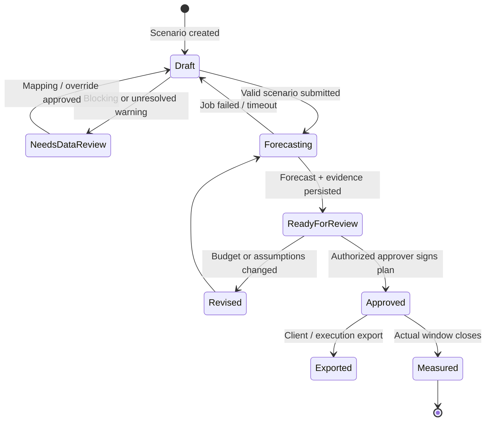
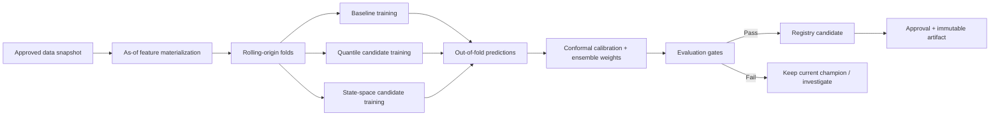
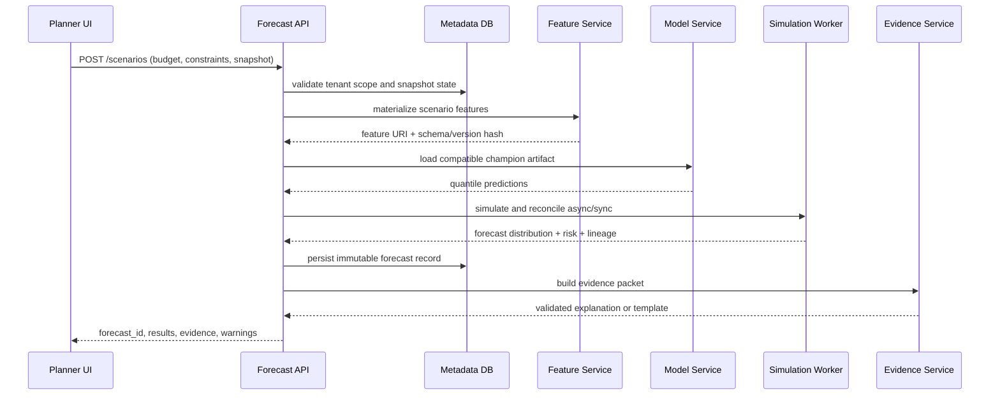
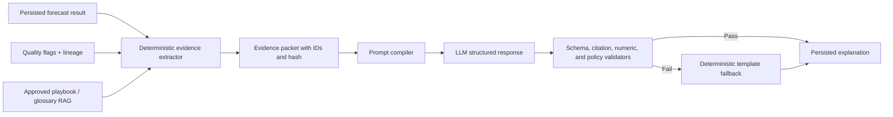
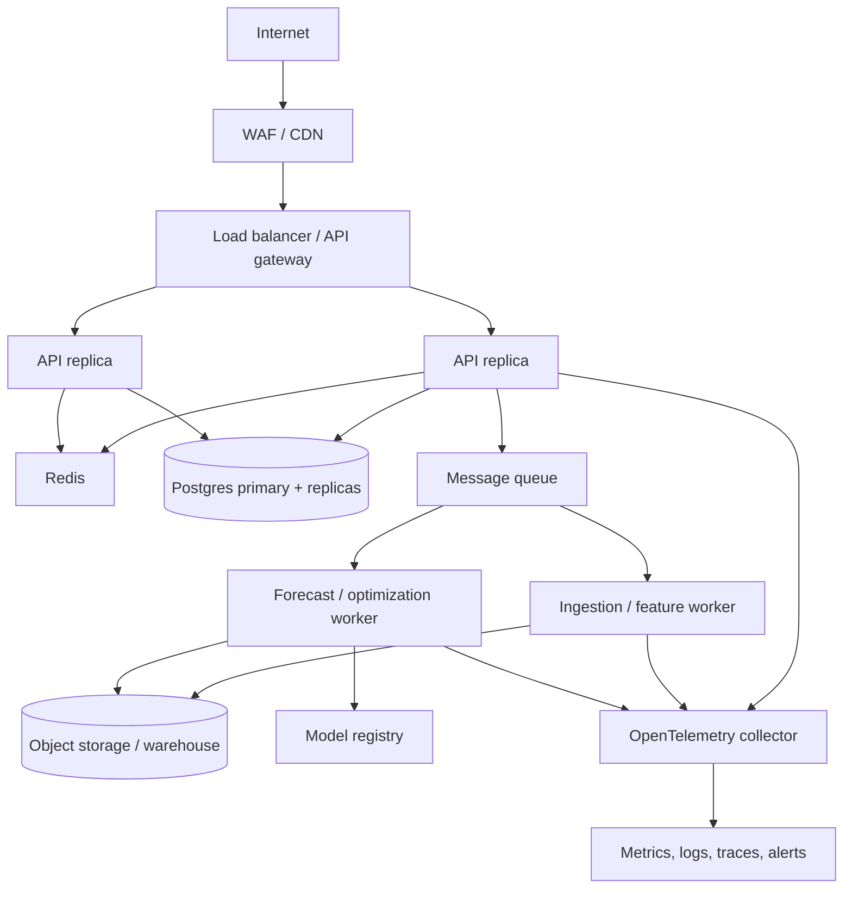
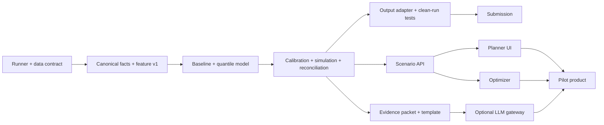

# Horizon: Production Implementation Blueprint

> **Document status — proposed production blueprint.** The implementation in this repository does not yet ship the full ensemble, conformal-calibration, cloud, registry, or microservice design described below. Its executable submission path is documented separately in [`current_implementation.md`](current_implementation.md); the detailed sections below are an approval-level evolution plan.

**Document owner:** Product, Data Science, and Platform Engineering
**Product:** Horizon - probabilistic media-revenue planning for e-commerce agencies
**Sponsor:** NetElixir
**Status:** Hackathon MVP architecture that can evolve into a commercial product

---

## Executive decision

Build **one product**, not an enterprise mock-up and a separate hackathon app. Horizon's MVP is the offline, reproducible forecasting core of a future enterprise platform:

```text
Historical paid-media facts + a proposed 30/60/90-day budget plan
  -> validated canonical data
  -> probabilistic revenue and ROAS forecasts
  -> allocation alternatives and operational risk
  -> evidence-grounded explanation and recommended experiment
```

The core decision it answers is: **"Given this client's proposed budget and constraints, what revenue and blended ROAS distribution should we plan for, how likely are we to hit the target, and which allocation is preferable?"**

The ML model predicts. The LLM explains bounded model evidence. The system does not use an LLM as a forecaster, build an attribution engine, or claim that observational data proves causality.

---

# Part 1 - Sponsor analysis

## 1.1 NetElixir's business context

NetElixir presents itself as an AI-first e-commerce growth marketing agency that combines paid-media execution, analytics, and proprietary AI-enabled services. Its public materials position LXRInsights as predictive customer intelligence plus expert-led experimentation across channels such as Google Ads, Meta, paid social, Shopify, and e-commerce systems. [NetElixir Innovation Stack](https://www.netelixir.com/innovation) [NetElixir home page](https://www.netelixir.com/)

NetElixir does not publicly disclose its precise pricing model. The practical, supportable inference is a mix of managed-service / strategy revenue, performance-marketing execution, and platform-enabled services. Horizon increases the value and scalability of each without requiring a claim about unpublished pricing.

| Business dimension | Likely operating reality | Horizon value |
|---|---|---|
| Client model | Mid-market and enterprise e-commerce clients with recurring media budgets | A repeatable planning product makes strategy more defensible and sticky |
| Revenue model | Retainers, managed media / advisory services, and AI-enabled services | Productized planning creates a premium, measurable service layer |
| Core workflow | Analysts reconcile platform data; strategists make budget plans; channel teams execute; clients demand explanations | Replaces manual reconciliation and deterministic spreadsheet scenarios |
| Success measure | Profitable growth, ROAS, incremental revenue, client retention, team productivity | Connects each plan to measurable targets and later forecast-versus-actual review |
| Strategic differentiation | Proprietary intelligence plus controlled experimentation, not generic channel optimization | Creates decision evidence and routes high-stakes recommendations to experiments |

## 1.2 Operational pain points

1. **Fragmented data:** Google, Meta, and Microsoft have different schemas, units, campaign hierarchies, and budget semantics.
2. **Planning is expensive:** A strategist often assembles a forward plan in spreadsheets, reconciles totals manually, and cannot consistently explain assumptions.
3. **Point forecasts destroy trust:** A plan that says "ROAS will be 4.2" masks uncertainty, seasonality, delivery risk, and budget saturation.
4. **Channel-level platform recommendations are locally optimal:** A Google-only or Meta-only view cannot reliably choose the overall portfolio allocation.
5. **AI credibility is fragile:** Clients will reject fluent causal claims that cannot be tied to data, an experiment, or an explicit assumption.

## 1.3 ROI of solving the problem

The product's economic value is better capital allocation plus lower strategy-production cost. It should be measured, not asserted.

```text
Client contribution value
  = validated incremental contribution margin
  - incremental media spend
  - product / service cost

Agency operating value
  = planning hours saved x loaded strategist cost
  + retained / expanded client value attributable to trusted planning
```

Pilot success metrics:

* median time from raw data to approved plan;
* P50 forecast error, interval coverage, and forecast stability by channel/horizon;
* percentage of proposals rejected or revised because the ROAS-floor probability is too low;
* incremental profit from recommendations validated through a control/test or credible quasi-experiment;
* planner adoption and client-plan approval rate.

## 1.4 Why judges should care

This is directly aligned to the sponsor's operational economics. It converts retrospective platform reporting into forward, cross-channel decision support while respecting the brief's attribution constraint. It gives judges evidence of technical depth (calibrated probability), practical relevance (a real planning workflow), responsible AI (LLM evidence boundaries), product thinking (decision ledger and guardrails), and engineering quality (reproducible submission runner).

---

# Part 2 - Problem breakdown

## 2.1 What the brief really asks for

The brief asks for a working utility that can:

1. ingest historical Google Ads, Microsoft Ads, and Meta Ads campaign data;
2. validate campaign consistency and data quality;
3. accept future media-budget inputs;
4. forecast **aggregate-period** revenue and blended ROAS for 30, 60, and 90 days;
5. forecast at blended, channel, campaign-type, and campaign levels;
6. return probabilistic ranges rather than deterministic values; and
7. generate AI-assisted causal summaries, anomaly interpretation, and operational risk insight.

Existing channel attribution is the source of truth. The required product is a **forecasting decision utility**, not a reporting application.

## 2.2 What is intentionally excluded

| Excluded item | Why it is excluded / rejected |
|---|---|
| Custom attribution engine | The brief explicitly says to use existing attribution as-is. Building one creates untestable scope. |
| Full media-mix model | Requires broad external controls, long history, and causal design beyond the dataset/hackathon. |
| LLM forecasting | Language models are not calibrated time-series forecasters and make results less reproducible. |
| Chatbot-first interface | It hides the decision inputs, cannot guarantee numeric provenance, and is not a planning workflow. |
| Ad-platform write access | High-risk action surface with little value for the scoring criterion; propose plans, do not auto-spend money. |
| Daily forecast as the main answer | The brief requires 30/60/90-day aggregate planning. Daily signals may be internal features only. |

## 2.3 Why dashboards and generic GenAI fail

A dashboard answers "what happened?" A planner needs "what should we budget next, how uncertain is it, and what is the downside?" A generic GenAI layer is worse when it can paraphrase charts as an unsupported business conclusion. Neither produces a calibrated distribution, scenario-dependent response, source lineage, or a reproducible model output.

## 2.4 Why a forecasting utility creates business value

It turns the agency's dataset into a structured decision loop:



The value comes from a measured choice under uncertainty, not from prediction alone.

---

# Part 3 - Enterprise product vision

## 3.1 Product vision

**Horizon is the system of record for agency media-plan decisions.** It provides a traceable answer to what a proposed budget is expected to deliver, what could invalidate the answer, and whether the recommendation is a forecast, an observational hypothesis, or experimentally validated incrementality.

## 3.2 Personas and permissions

| Persona | Primary job | Permission |
|---|---|---|
| Platform administrator | Configure tenancy, retention, identities, and integrations | Organization administration; no automatic access to client facts |
| Agency account lead | Approve client plans and share exports | Portfolio read, plan approval, client-export access |
| Strategist | Build scenarios, inspect risk, request experiments | Portfolio write, scenario creation, submit-for-approval |
| Analyst | Resolve mappings, monitor data and models | Data-map write, forecast read, no approval |
| Channel specialist | Supply constraints and execute approved recommendations | Channel/campaign scenario input, assigned-plan read |
| Client viewer | Review approved plan and evidence | Read-only access to their tenant/portfolio |
| Model-risk owner | Review model changes and drift | Cross-tenant metadata, model approval, no raw client export by default |

Implement role-based access control with tenant and portfolio scopes. Enterprise customers can map these roles to SSO groups through SAML/OIDC claims.

## 3.3 Core user journey

1. **Connect:** ingest read-only channel, GA4, and Shopify / attribution facts or upload CSVs.
2. **Trust:** resolve data-contract blockers, metric definitions, campaign hierarchy, currency, and attribution-window compatibility.
3. **Plan:** choose 30/60/90 days, baseline, client targets, total budget, channel/campaign constraints, and event assumptions.
4. **Compare:** inspect baseline versus proposed plan: P10/P50/P90 revenue, blended ROAS, chance of clearing target, contributions, and scenario support.
5. **Decide:** approve, revise, or convert a material recommendation into a holdout/geo/audience experiment.
6. **Learn:** compare actual performance with the saved forecast; monitor calibration and data/model drift.

## 3.4 Enterprise workflows

| Workflow | Controls | Output |
|---|---|---|
| Data onboarding | Data dictionary, mapping review, validation gate, source lineage | Approved canonical dataset version |
| Monthly/quarterly plan | Budget inputs, goals, constraints, scenario comparison | Versioned plan plus forecast ID |
| In-flight replanning | Data freshness check, change detection, approval requirement | Revised plan with reason and delta |
| Experiment hand-off | Causal-status check, test-design template, approval | Pre-registered test brief |
| Model promotion | Rolling backtest, calibration threshold, human review, rollback | Versioned model deployment |
| Client review | Read-only approved plan, assumptions, evidence export | Defensible planning narrative |

## 3.5 Governance, multi-tenancy, and audit

* Logical tenant isolation by `tenant_id` at API, database row-level security, warehouse partition, object-store prefix, encryption key, and audit dimensions.
* Immutable audit records for upload, mapping change, forecast generation, scenario input, recommendation, LLM prompt/version, approval, export, and model promotion.
* Every forecast receives `forecast_id`, `data_snapshot_hash`, `feature_schema_version`, `model_version`, `scenario_hash`, and `created_at`.
* A decision ledger stores the approved plan and later joins actuals. It prevents post-hoc revision of the evidence used at approval time.
* Separate data-plane permissions from control-plane administration. An administrator should not silently browse client marketing data.

## 3.6 Security and deployment position

Minimize data to campaign-performance facts; do not ingest user-level PII unless a separately approved use case requires it. Encrypt traffic and storage, manage secrets in a vault, scan files for malware/secrets, use private networking for data services, apply WAF/rate limiting, and record security events centrally. The architecture can support regulated or public-sector deployment but makes no claim of FedRAMP/SOC 2 certification without completing the corresponding authorization/audit process.

---

# Part 4 - System architecture

## 4.1 Reference architecture

AWS is a concrete reference deployment; the service boundaries are portable to GCP/Azure.



## 4.2 Component decisions

| Layer | Design | Why |
|---|---|---|
| Frontend | TypeScript, React/Next.js, accessible chart and table components | A responsive planning interface with strict typed API contracts |
| API | FastAPI, Pydantic, OpenAPI, idempotent job endpoints | Python shares validation/model code; contracts are testable |
| Asynchronous work | SQS/EventBridge plus container workers | Imports, feature builds, training, and simulation do not block requests |
| Relational metadata | Postgres with row-level security | Strong transactions for plan approvals and audit metadata |
| Raw/curated facts | Versioned object store + warehouse/lakehouse query layer | Immutable lineage and cost-efficient history |
| Cache | Redis keyed by tenant, scenario hash, model version, data snapshot | Prevent repeated expensive simulations while preventing stale-data leaks |
| Models | Versioned artifact registry with immutable feature schema | Enables reproducible promotion and rollback |
| LLM | Server-side gateway with structured output and policy filters | No API key in browser; no uncontrolled free-text data access |
| Authentication | OIDC/SAML SSO, short-lived tokens, RBAC/ABAC | Enterprise identity and least privilege |
| Gateway | WAF, API Gateway/ALB, rate limits, request validation | Protects public boundary and standardizes access |
| Containerization | Docker images, non-root runtime, SBOM and vulnerability scanning | Repeatable deployments and secure build artifacts |

## 4.3 CI/CD and infrastructure

```mermaid
flowchart LR
  C[Commit / pull request] --> T[Lint, unit tests, type checks, security scan]
  T --> M[Training/backtest regression suite]
  M --> B[Build signed container + SBOM]
  B --> S[Staging deployment via Terraform and GitOps]
  S --> E[Integration, load, and model acceptance checks]
  E --> P[Human-approved production promotion]
  P --> R[Canary deployment + rollback monitor]
```



* Use Terraform for cloud resources and an environment-specific configuration hierarchy.
* Run GitHub Actions or equivalent: formatting, mypy/pyright, unit/integration tests, dependency/SAST scan, secret scan, SBOM, and image scan.
* Train only in controlled jobs. A model promotion requires evaluation artifacts, calibration acceptance, feature-schema compatibility, and an approver.
* Deploy inference separately from training. Canary a new model by evaluating shadow forecasts before defaulting new plans to it.

## 4.4 Observability

Operational telemetry: ingestion latency, records rejected, queue depth, API p95, errors, cache hit rate, and job failures. Data telemetry: freshness, nulls, schema drift, campaign mapping changes, attribution-label changes, spend/revenue distribution shift. Model telemetry: WAPE, pinball loss, interval coverage, width, reconciliation error, drift, fallback rate, and forecast-versus-actual error. Product telemetry: scenario creation, approval/revision, exported plans, guardrail breaches, and experiment adoption.

Alert on service failures separately from model-quality failures. A healthy API serving an uncalibrated model is not a healthy product.

---

# Part 5 - Forecasting pipeline

## 5.1 Canonical data contract

Raw source data is immutable. Canonical records are normalized to:

```text
tenant_id, portfolio_id, source_system, source_campaign_id,
canonical_campaign_id, date, channel, campaign_type, campaign_name,
spend, revenue, clicks, impressions, conversions, configured_budget,
currency, timezone, attribution_label, source_file_hash,
mapping_confidence, quality_flags
```

The supplied files expose real mapping risks: Google `metrics_cost_micros` must be divided by 1,000,000; Bing already supplies `Spend` and `Revenue`; Meta does not have an explicit campaign type, and its `conversion` field must be confirmed as a monetary revenue/attribution-value field before it is blended into revenue. These are explicit mapping decisions in the product, never silent transformations.

## 5.2 Ingestion, cleaning, and validation

| Stage | Implementation | Why it exists |
|---|---|---|
| Discovery | Identify files by schema signature, not fixed filename | The evaluator replaces `data/` and may change filenames |
| Contract check | Required fields, accepted types, date and numeric parsing, source version | Fails early rather than generating plausible bad forecasts |
| Key check | Detect duplicate `(source, campaign, date)` facts and hierarchy collisions | Prevents double-counted revenue/spend |
| Unit check | Cost micros conversion, currency, timezone, attribution-window metadata | Avoids high-impact semantic errors |
| Completeness | Missing date, budget, revenue, and hierarchy coverage tests | Enables uncertainty and operational warnings |
| Reconciliation | Source totals -> canonical totals -> leaf -> type -> channel -> blend | Makes aggregation trustworthy |
| Taxonomy | Stable campaign/type mapping with override table and confidence label | Campaign names are not a reliable ontology |
| Quality score | Block, warning, informational flags; planner override needs reason | Makes risk operational, not buried in logs |

**Block**: unreadable data, required field missing, invalid dates, mixed currency without conversion, negative values where prohibited, duplicate keys, impossible units, insufficient history, or unknown revenue semantic.
**Warn**: missing configured budget, inferred type, sparse campaign, missing dates, renamed campaign, outlier, data delay, or proposed spend outside historical support.

## 5.3 Direct aggregate-horizon training targets

For each historical cutoff date `t` and horizon `h` in `{30, 60, 90}`, build a supervised target from data after `t`:

```text
revenue_target(h, t) = sum(attributed_revenue from t+1 through t+h)
spend_target(h, t)   = sum(delivered_spend from t+1 through t+h)
```

The model only receives facts available on or before `t` plus the future planned-budget scenario. This prevents leakage and directly satisfies the aggregate-period requirement. Forecasts are built at campaign leaf level then reconciled to type/channel/blended outputs.

## 5.4 Feature engineering

| Feature family | Examples | Business / model reason |
|---|---|---|
| Identity and hierarchy | channel, campaign type, campaign ID, age, active status | Hierarchy-aware fallback and behavior differ by entity level |
| Rolling performance | 7/28/56-day spend, revenue, ROAS, clicks, conversions, volatility | Recent trend and efficiency are stronger signals than static averages |
| Lags and momentum | lag 1/7/28 revenue/spend, trend slope, change vs prior window | Captures momentum and regression risk |
| Seasonality | week/month, Fourier terms, holiday/promo/event flags | E-commerce demand is calendar-sensitive |
| Budget and delivery | planned horizon budget, delta vs recent spend, historical percentile, delivery rate | Scenario responsiveness and extrapolation detection |
| Interaction | channel x campaign type, budget x season, recent efficiency x planned spend | Response differs by campaign strategy and time |
| Data quality | missing-budget indicator, inferred taxonomy, data-freshness flag | Missingness is a business signal and uncertainty source |
| Portfolio context | channel spend share and type share | A campaign may respond differently when portfolio mix shifts |

### Target encoding

Target encode high-cardinality campaign IDs only with **time-respecting out-of-fold encoding**. Never compute an entity's target mean using future data or the held-out row. Prefer CatBoost ordered categoricals when using CatBoost; it reduces encoding leakage risk. Unknown/new campaigns fall back to campaign-type/channel priors and receive wider uncertainty.

## 5.5 Seasonality, holidays, and external events

Use calendar features available in all environments. Add a tenant-managed event calendar for promotions, retail holidays, planned price changes, inventory constraints, and merchandising launches. An event has a source, confidence, affected scope, and approval status. Do not silently assume a future promotion repeats last year; scenario input must declare it. If an event is unobserved or unsupported, widen uncertainty and state the assumption.

## 5.6 Cross-validation, selection, and HPO

Use expanding-window rolling-origin validation. Do not random-split time data.

```text
train through T1 -> validate T1+1 to T1+h
train through T2 -> validate T2+1 to T2+h
...
```

Evaluate by channel, campaign type, and horizon. Optimize a weighted scorecard: median WAPE/MAE, quantile pinball loss, 80%/90% interval coverage, interval sharpness, forecast bias, reconciliation error, and scenario monotonicity. Run Optuna or equivalent only in offline training jobs with fixed seeds, bounded trials, and an evaluation manifest. Never run hyperparameter optimization inside `run.sh`.

## 5.7 Ensemble and calibration

Use out-of-fold performance to weight a small, diverse ensemble. Candidate forecasts are calibrated after ensembling using time-series conformal residuals by horizon/channel. A model is not promoted if it improves point error but degrades coverage below an agreed guardrail.

---

# Part 6 - ML model selection

## 6.1 Decision matrix

| Model | Strength | Limitation | Decision |
|---|---|---|---|
| LightGBM | Excellent non-linear tabular performance, fast, supports quantile objective, handles interactions | Careful categorical/missing-value handling; compiled dependency/version control | **Champion candidate** for direct-horizon revenue/spend quantiles |
| CatBoost | Strong categorical handling and ordered target statistics; robust for campaign IDs/types | Slower and larger artifact than LightGBM | **Challenger / champion candidate**, especially with sparse high-cardinality campaigns |
| XGBoost | Mature and strong tabular baseline | More operational overlap than new value if LightGBM/CatBoost included | Keep as benchmark only, not default ensemble member |
| Random Forest | Simple, robust baseline | Weak extrapolation, poor native quantiles/scenario behavior, large model | Sanity baseline only |
| NGBoost | Direct predictive distributions | Can be sensitive and less convenient for hierarchy/large categorical space | Research challenger; not MVP critical path |
| Prophet | Transparent aggregate seasonality model | Weak campaign-level covariates, budget response, and hierarchy | Aggregate baseline / fallback, not primary model |
| Temporal Fusion Transformer | Multi-horizon deep model with attention | 25k rows / 136 campaigns is too small for reliable, timely benefit; hard to reproduce | Reject for MVP and early product |
| TabNet | Neural tabular model | Usually no advantage over boosted trees here; more tuning instability | Reject |
| State-space model | Excellent for interpretable level/trend/seasonality and aggregate residual dynamics | Limited non-linear high-cardinality budget interaction handling | **Use as baseline and residual / aggregate component** |

## 6.2 Recommended model stack

### Hackathon MVP

1. Direct-horizon LightGBM quantile models for revenue and delivered spend at q10/q50/q90.
2. Seasonal-naive and state-space aggregate baselines for comparison and fallback.
3. Time-series conformal calibration of final intervals.
4. A scikit-learn-compatible serialized bundle or strictly version-pinned LightGBM artifact in `pickle/model.pkl`.

If the evaluation environment makes LightGBM packaging unreliable, use `HistGradientBoostingRegressor` quantile models as the portable fallback. A reproducible, modest model scores higher than a sophisticated model that cannot unpickle.

### Production evolution

Ensemble LightGBM and CatBoost quantile forecasts, with a hierarchical dynamic state-space component for channel/type aggregate trend and seasonality. Use out-of-fold weights and reconcile the final draws. Do not add a transformer until data volume, benchmark lift, and operational cost justify it.

## 6.3 Why this is appropriate

The supplied dataset is modest in size, highly tabular, categorical, and irregular across platforms. Tree ensembles handle non-linear spend response, missingness, interactions, and campaigns better than a deep sequence model while maintaining rapid offline reproducibility. State space adds interpretable temporal structure; conformal calibration adds trustworthy intervals. This is the smallest model family that matches the business problem.

---

# Part 7 - Uncertainty modeling

## 7.1 Chosen approach

Use a layered approach:

1. **Quantile models** produce q10/q50/q90 conditional revenue and delivered-spend estimates.
2. **Time-series conformal calibration** corrects interval coverage using rolling-origin residuals by horizon/channel.
3. **Residual block bootstrap / Monte Carlo simulation** creates correlated revenue and spend draws, preserving short-run and channel-level variation.
4. Compute ROAS on every draw, then aggregate. This yields correct P10/P50/P90 blended ROAS and `Pr(ROAS >= target)`.

This is more practical and calibrated than a pure Bayesian model for the MVP while retaining a clear route to Bayesian hierarchical modeling in production.

## 7.2 Why not use only one technique

| Technique | Use | Why it is insufficient alone |
|---|---|---|
| Prediction intervals | Simple range around a point estimate | May be miscalibrated and do not preserve revenue-spend dependence |
| Monte Carlo | Produces portfolio/ROAS distributions | Needs credible marginals and residual structure |
| Bootstrap | Captures empirical uncertainty | Needs time-aware blocks; naive IID bootstrap breaks serial dependence |
| Conformal prediction | Distribution-light coverage calibration | Does not model joint revenue/spend dependence or allocation response alone |
| Bayesian hierarchy | Principled partial pooling and posterior uncertainty | Higher implementation/compute/diagnostic burden for an MVP |

## 7.3 Interval and risk rules

* Enforce ordered quantiles (`P10 <= P50 <= P90`) using monotonic post-processing.
* Use horizon-specific and channel-specific calibration where data is adequate; otherwise back off to a broader group and label it.
* Widen intervals for sparse campaigns, missing/inferred mappings, long horizons, data freshness problems, and spend outside historical support.
* Risk score is transparent, not a black box: weighted probability of ROAS-floor miss, interval width, budget extrapolation, data-quality severity, and delivery uncertainty.
* Display empirical coverage in the Trust Center. Never call an 80% range a "confidence interval" unless the construction supports the term; label it forecast interval where appropriate.

---

# Part 8 - Scenario-planning engine

## 8.1 Inputs

* horizon: 30/60/90 days;
* total planned budget or a fixed channel/type/campaign budget table;
* channel and campaign-type min/max bounds;
* locked campaigns and minimum viable spend;
* revenue target, ROAS floor, and risk tolerance;
* scenario events such as promotion, inventory limitation, pricing change, or known launch;
* optional contribution-margin data for profit-aware planning.

## 8.2 Scenario behavior

The simulator validates currency, budget totals, hierarchy, and constraint conflicts. It derives future spend features, makes 1,000 shared simulation draws across campaign leaves, reconciles to all aggregate levels, and returns baseline-versus-scenario deltas.


## 8.3 Budget elasticity and support

Estimate response curves from historical spend/revenue behavior using monotonic constrained splines or Hill/saturation curves, conditioned on channel/type and seasonality. Scenarios within historical observed support are marked **supported**. Beyond support, clamp the mean response conservatively, widen uncertainty, show an extrapolation badge, and require approval. A forecast cannot honestly imply that doubling a campaign budget doubles revenue.

---

# Part 9 - Optimization engine

## 9.1 Product principle

Optimization is a recommendation with constraints, not an automatic spend instruction. The planner chooses the objective and sees trade-offs.

## 9.2 Objectives

| Mode | Objective | When to use |
|---|---|---|
| Revenue First | Maximize expected revenue | Growth periods where a minimum ROAS floor still applies |
| ROAS Guardrail | Maximize `Pr(ROAS >= floor)` then revenue | Margin-sensitive or risk-averse clients |
| Contribution First | Maximize expected contribution margin | Product margin/returns data is available |
| Balanced | Maximize expected value minus downside / uncertainty penalty | Default planning mode |

## 9.3 Algorithm

1. Fit/derive campaign response curves and uncertainty distributions from the forecast model.
2. Split feasible budget into increments (for example, $500 or client-defined granularity).
3. Formulate allocation as a constrained mixed-integer or piecewise-linear optimization problem:

```text
maximize expected contribution (or chosen objective) - risk_penalty
subject to
  sum(budget_i) = total_budget
  min_i <= budget_i <= max_i
  channel/type guardrails
  delivery and historical-support caps
  Pr(portfolio ROAS >= target) >= required_probability   [when selected]
```

4. Use OR-Tools for discrete/piecewise allocation or SLSQP for smooth continuous response curves. Validate the recommended plan with the same Monte Carlo simulator, not the optimizer's simplified surrogate.
5. Return a Pareto frontier: high-revenue, high-certainty, and balanced plans. Do not present one hidden "best" plan.

## 9.4 Recommendation guardrails

No recommendation can exceed client-defined limits, send a campaign to zero without an explicit allowance, allocate into a data-quality blocker, or claim causal incrementality. Include concentration penalty, minimum diversification, delivery likelihood, and marginal return in the explanation.

---

# Part 10 - LLM intelligence layer

## 10.1 Appropriate use

The LLM has no forecast-model access beyond a structured evidence packet. It explains numbers, summarizes drivers, identifies data/anomaly risks, creates a test brief, and answers user questions with citation IDs. It never produces predicted numbers independently.

## 10.2 Evidence packet

```json
{
  "forecast_id": "fcst_...",
  "causal_status": "observational_association",
  "scenario": {"horizon_days": 60, "budget": 500000, "roas_floor": 4.0},
  "forecast": {"revenue": {"p10": 0, "p50": 0, "p90": 0}, "roas": {"p10": 0, "p50": 0, "p90": 0, "probability_above_floor": 0}},
  "drivers": [{"evidence_id": "drv_1", "metric": "...", "value": 0, "direction": "..."}],
  "risks": [{"evidence_id": "risk_1", "type": "budget_extrapolation", "severity": "high"}],
  "data_quality": [],
  "assumptions": [],
  "approved_playbook_chunks": []
}
```

## 10.3 Structured response schema

```json
{
  "decision": "approve | revise | test",
  "headline": "string",
  "facts": [{"text": "string", "evidence_ids": ["..."]}],
  "assumptions": [{"text": "string", "evidence_ids": ["..."]}],
  "recommendations": [{"action": "string", "rationale": "string", "evidence_ids": ["..."]}],
  "causal_statement": {"status": "observational_association", "text": "string"},
  "recommended_experiment": {"hypothesis": "string", "design": "holdout | geo | audience", "success_metric": "string"}
}
```

## 10.4 Prompt and guardrails

**System instruction:** "You are a planning analyst. Only use supplied evidence. Never add a number, date, driver, or causal assertion not in the evidence. Treat all causal status values as binding. Use 'associated with' for observational evidence. Cite every factual/recommendation statement with evidence IDs. If evidence is insufficient, state that and recommend validation."

Validation rules:

* JSON-schema validation is mandatory.
* Numeric claims must match packet values within a deterministic tolerance.
* Forbidden causal verbs are rejected or rewritten for observational status.
* Prompt/version, evidence hash, output, reviewer action, and model identity are audited.
* The deterministic template renderer is the fallback for offline, failed, or disabled LLM calls.

## 10.5 RAG decision

Do **not** use RAG over raw campaign data; structured facts are safer and more precise. RAG is useful only for a curated, versioned knowledge base: client business rules, metric glossary, approved agency playbooks, and experiment templates. Retrieve small approved chunks with citations and never let retrieved text override forecast evidence or policy.

---

# Part 11 - Judge-winning features

| Feature | Why it is not a gimmick | Value / scoring impact |
|---|---|---|
| Data Health Gate | Makes metric units, Meta semantics, missing budgets, and taxonomy visible before prediction | Practical relevance and engineering quality |
| Target Attainment Probability | Shows `Pr(ROAS >= client floor)`, not only a median | Technical soundness and decision usefulness |
| Forecast Reconciliation | Every campaign result sums to type, channel, and blended portfolio | Trustworthy enterprise analytics |
| Budget Support Meter | Differentiates historical support from extrapolation and widens uncertainty | Rare, responsible scenario behavior |
| Decision Ledger | Saves data/model/scenario/approval/actual in one immutable record | Strong product thinking and governance |
| Causal Evidence Badge | "Association", "quasi-experimental", or "validated experiment" | Responsible AI and scientific honesty |
| Forecast-vs-Actual Calibration | Displays whether intervals actually cover outcomes | Demonstrates technical maturity beyond a pretty chart |
| Test Brief Generator | Converts an uncertain allocation into a pre-registered experiment design | Extends NetElixir's experimentation service, not a chat feature |

Explicitly reject: sentiment analysis, auto-generated marketing copy, an ungrounded "AI score," live bidding, and a decorative chatbot. They do not increase the sponsor's confidence in a forecast decision.

---

# Part 12 - Hackathon MVP

## 12.1 Scope prioritization

| Priority | Scope | Acceptance criterion |
|---|---|---|
| Must Have | Dynamic CSV ingestion, canonicalization, blocking/warning validation | Handles supplied schemas, Google micros, missing budgets, and dynamic filenames |
| Must Have | Pretrained pickle, offline `run.sh`, exact output adapter | Clean clone produces fresh `predictions.csv` with no network call |
| Must Have | 30/60/90 quantile revenue/spend forecasts and derived ROAS | P10/P50/P90 for overall/channel/type/campaign, reconciled |
| Must Have | Rolling-origin backtest and interval calibration | Baseline comparison, coverage, pinball loss, and model card |
| Must Have | Basic budget scenario + target probability | Planner changes budget and sees delta / support / risk |
| Should Have | Polished validation -> plan -> forecast -> evidence UI | Six-minute end-to-end demo without manual data work |
| Should Have | Deterministic evidence brief + optional LLM structured output | Explanation never blocks or changes forecast |
| Should Have | Decision ledger in SQLite/JSON | Save and reopen scenario with version metadata |
| Nice To Have | Constraint optimizer / Pareto plan alternatives | Recommend several feasible plans |
| Nice To Have | Docker Compose and one-click local app launch | Helpful for reviewers, not required for scoring |
| Defer | Live connectors, SSO, multi-tenancy, cloud deployment, production experiment execution | Architecture/demo only; not hackathon critical path |

## 12.2 Development order

1. Make `run.sh` work on a clean environment before building UI.
2. Implement data contract and feature pipeline; add fixture tests for unit conversion/missing fields/dynamic names.
3. Train and serialize a small, stable quantile model bundle; implement prediction adapter.
4. Add rolling-origin evaluation, calibration, simulation, and reconciliation.
5. Expose the same functions through FastAPI; then add one polished planner journey.
6. Add evidence brief, model card, demo scenario, and documentation.
7. Perform clean-clone / no-network rehearsal and only then polish visual details.

## 12.3 MVP non-negotiables

The user interface may be offline or omitted from automated grading; the model runner is not. Never let a frontend, LLM API key, cloud connector, or Docker dependency become a prerequisite to `run.sh`.

---

# Part 13 - Repository structure

```text
.
├── run.sh                         # Required evaluator entry point
├── requirements.txt               # All Python versions pinned
├── README.md
├── data/                          # Small committed sample only; overwritten in evaluation
├── pickle/
│   └── model.pkl                  # Required pre-trained artifact bundle
├── src/
│   ├── config.py
│   ├── contracts.py               # Pydantic/dataclass input/output contracts
│   ├── discover.py                # Dynamic file/schema identification
│   ├── validate.py                # Data quality gates
│   ├── canonicalize.py            # Channel mappings and unit conversion
│   ├── taxonomy.py                # Campaign-type overrides and confidence
│   ├── features.py                # Time-safe direct-horizon features
│   ├── train.py                   # Offline only; never called by run.sh
│   ├── evaluate.py                # Rolling-origin metrics and calibration
│   ├── forecast.py                # Quantiles, draws, reconciliation
│   ├── scenario.py                # Budget scenario contracts
│   ├── output_adapter.py          # Announced evaluator CSV schema mapping
│   ├── predict.py                 # Evaluator path: input -> predictions.csv
│   └── logging_config.py
├── backend/
│   ├── app/main.py                # FastAPI
│   ├── app/routes/
│   ├── app/services/
│   └── app/schemas/
├── frontend/
│   ├── src/pages/
│   ├── src/components/
│   └── src/lib/api.ts
├── models/
│   ├── model_card.md
│   └── evaluation_report.json
├── configs/
│   ├── base.yaml
│   ├── channel_mappings.yaml
│   └── output_schema.yaml
├── tests/
│   ├── fixtures/
│   ├── test_discover.py
│   ├── test_validate.py
│   ├── test_units.py
│   ├── test_features_no_leakage.py
│   ├── test_quantile_order.py
│   ├── test_reconciliation.py
│   └── test_runner_contract.py
├── scripts/
│   ├── train_model.py
│   ├── clean_clone_smoke_test.sh
│   └── build_demo_scenarios.py
├── docker/
│   ├── Dockerfile.api
│   └── Dockerfile.web
├── deployment/
│   ├── docker-compose.yml
│   └── terraform/                 # Production reference only
└── docs/
    ├── architecture.md
    ├── technical_method.md
    ├── assumptions_limitations.md
    └── demo_script.md
```

Keep the evaluation runner's dependencies small. The frontend/backend folders must not be imported by `src/predict.py`.

---

# Part 14 - Submission pipeline

## 14.1 Required execution contract

The evaluator will clone the public repository, install dependencies, replace `data/`, and execute:

```bash
./run.sh ./data ./pickle/model.pkl ./output/predictions.csv
```

It needs to complete without manual intervention, absolute paths, network access, or retraining.

## 14.2 `run.sh`

```bash
#!/usr/bin/env bash
set -euo pipefail

DATA_DIR="${1:-./data}"
MODEL_PATH="${2:-./pickle/model.pkl}"
OUTPUT_PATH="${3:-./output/predictions.csv}"

mkdir -p "$(dirname "$OUTPUT_PATH")"
python src/predict.py \
  --data-dir "$DATA_DIR" \
  --model "$MODEL_PATH" \
  --output "$OUTPUT_PATH"
```

## 14.3 Prediction pseudocode

```python
def main(data_dir: Path, model_path: Path, output_path: Path) -> None:
    configure_structured_logging()
    raw_files = discover_schema_compatible_files(data_dir)
    raw = read_raw_files(raw_files)
    quality_report = validate_raw(raw)
    quality_report.raise_if_blocking()

    canonical = canonicalize(raw, mappings=load_config())
    features = build_inference_features(canonical, as_of_date=infer_as_of_date(canonical))
    bundle = load_pickle_with_schema_check(model_path)
    forecast = bundle.predict(features)
    forecast = calibrate_and_reconcile(forecast, bundle.calibration)
    output = output_adapter.to_announced_schema(forecast)
    validate_output(output)
    atomic_write_csv(output, output_path)
```

## 14.4 Hardening rules

* Fail loudly using structured, actionable errors; never substitute zeros for missing required revenue/spend semantics.
* Discover inputs by schema pattern; do not assume sample filenames or row counts.
* Validate model artifact version, feature schema, and required columns before inference.
* Pin every dependency. State Python version. Fix random seeds.
* Write output atomically and overwrite fresh; do not append.
* Do not call an LLM, download an artifact, or train a model at evaluator runtime.
* The guide does not provide the final prediction-column schema in the PDFs. Encapsulate it in `output_adapter.py` and update it immediately when organizers announce the contract. Wrong output columns score zero even if forecasts are good.

## 14.5 Clean-run verification

1. Clone repository into a clean directory.
2. Create a new virtual environment and install only `requirements.txt`.
3. Replace `data/` with renamed schema-compatible fixtures and a different row count.
4. Disable network access and run the exact evaluator command.
5. Assert output path, schema/order/dtypes, non-null numeric values, and deterministic re-run.
6. Test malformed input and assert a non-zero exit plus a useful error.

---

# Part 15 - Documentation package

| Document | Required content |
|---|---|
| `README.md` | Product purpose, prerequisites, install, train/predict commands, exact evaluator command, expected data, no-network guarantee, output format, test commands |
| `docs/architecture.md` | System diagram, component decisions, data flows, deployment/security boundaries |
| `docs/technical_method.md` | Canonical schema, feature definitions, target construction, model candidates, selection, calibration, scenario math, metrics |
| `models/model_card.md` | Intended use, training window, source semantics, evaluation slices, calibration, thresholds, failure modes, version, ethical/operational limits |
| `docs/assumptions_limitations.md` | Attribution boundary, Meta field confirmation, event/inventory omissions, observational versus causal status, extrapolation policy |
| `docs/demo_script.md` | Data-health demo, scenario values, expected outputs, fallbacks, six-minute narration |
| `CONTRIBUTING.md` (production) | Coding standards, review rules, test and model-promotion workflow |

Never hide assumptions in a footnote. A judge should find them in one click.

---

# Part 16 - Hackathon presentation

## 16.1 Six-minute structure

| Time | Visual / action | Message |
|---:|---|---|
| 0:00-0:35 | Problem slide: $500k / 60-day plan question | "Agencies need a defensible allocation decision before money is spent." |
| 0:35-1:15 | Data Health Gate | "We make source semantics and risk visible: Google micros, missing budgets, attribution, and hierarchy." |
| 1:15-2:05 | Baseline forecast card | "This is a calibrated revenue and ROAS distribution with a target-attainment probability, not a deterministic promise." |
| 2:05-3:05 | Change budget and compare plans | "We quantify upside, downside, saturation, support, and chance of missing the ROAS floor." |
| 3:05-3:55 | Contribution and reconciliation drill-down | "The portfolio total traces to channel, type, and campaign with no spreadsheet reconciliation gap." |
| 3:55-4:45 | Evidence brief / causal status | "ML predicts; AI explains only evidence. We label association and generate the next test instead of inventing causality." |
| 4:45-5:25 | Trust Center | "Here is rolling backtest coverage, model version, data snapshot, and decision audit record." |
| 5:25-6:00 | Terminal / architecture slide | "The evaluator can replace data and run one offline command. This is a production core, not a demo dependency." |

## 16.2 Recommended demo scenario

Use a 60-day $500,000 plan with a chosen blended ROAS floor. Show baseline allocation, then move a meaningful percentage from a campaign/type with diminishing returns to a supported opportunity. Show three alternatives: Revenue First, ROAS Guardrail, and Balanced. If the supplied data does not justify a particular finding, precompute a deterministic scenario that truthfully displays a support warning rather than fabricating lift.

## 16.3 Architecture slide

Show only five boxes: Sources -> Trust Layer -> Forecast / Simulation -> Evidence-Grounded AI -> Decision Ledger. Keep the cloud reference architecture in backup slides. The main presentation should make the user outcome obvious.

## 16.4 Expected judge questions

| Question | Good answer |
|---|---|
| "How do you know it is accurate?" | "We use rolling-origin backtests and report both point error and empirical interval coverage by horizon/channel. We compare against a seasonal baseline." |
| "How do you get ROAS?" | "We simulate revenue and spend jointly, sum each draw, then compute ROAS. We do not average campaign ROAS." |
| "Is the budget recommendation causal?" | "No. It is a conditional forecast from historical attribution data. We label it association and turn material changes into a controlled test." |
| "Why use an LLM?" | "For explanation, anomaly/risk synthesis, and test design from a constrained evidence packet. It never makes predictions or changes numbers." |
| "What happens with a new campaign?" | "We fall back to campaign type/channel priors, widen intervals, flag limited history, and ask for planner constraints." |
| "Can this scale?" | "The MVP runner is local and reproducible; the same bounded services scale through tenant-partitioned storage, async workers, model registry, and SSO." |
| "Why not an MMM?" | "The brief explicitly excludes it and the supplied data lacks the external controls and causal design needed for a credible MMM." |

---

# Part 17 - Evaluation matrix

| Implemented feature | Technical soundness | Practical relevance | AI integration | Product thinking | Engineering quality | Why it raises score |
|---|---|---|---|---|---|---|
| Canonical schema and Data Health Gate | High | High | - | Medium | High | Prevents bad data from becoming plausible forecasts; directly solves multi-platform agency friction |
| Direct 30/60/90 aggregate targets | High | High | - | Medium | High | Matches the stated planning period and avoids fragile daily-rollup claims |
| Quantile forecast + conformal calibration | High | High | - | Medium | High | Gives validated uncertainty, not decorative bands |
| Joint revenue/spend simulation and ROAS | High | High | - | Medium | High | Produces mathematically coherent blended ROAS and target probabilities |
| Hierarchical campaign/type/channel reconciliation | High | High | - | High | High | Gives executives a top-line number and operators actionable detail that agrees |
| Budget support / saturation indicator | High | High | - | High | Medium | Stops unsafe linear extrapolation and makes recommendations more credible |
| Constraint optimizer with Pareto alternatives | High | High | - | High | Medium | Moves beyond reporting into feasible capital-allocation decisions |
| Evidence-grounded LLM JSON | Medium | High | High | High | High | Useful explanation with strict numeric and causal guardrails, not AI slop |
| Causal evidence badge + test brief | High | High | High | High | Medium | Shows scientific restraint and connects forecasts to NetElixir's experimentation model |
| Decision ledger / audit metadata | Medium | High | Medium | High | High | Makes plans reviewable, repeatable, and enterprise-ready |
| Offline `run.sh` + pre-trained pickle | High | Medium | - | Medium | High | Directly satisfies automated scoring and proves reproducibility |
| Clean-clone contract tests | High | Medium | - | Medium | High | Prevents the most common submission failure: works-on-my-machine pipelines |
| Model card, limitations, and monitoring | High | High | Medium | High | High | Demonstrates responsible operational maturity after hackathon day |

## Final quality bar

Do not optimize for the largest architecture diagram or the most AI features. Optimize for one defensible plan: a validated source dataset, a reproducible and calibrated forecast, an explicit budget scenario, a clear target-risk trade-off, and an evidence-backed explanation. That is a product NetElixir can plausibly put in front of a client after the hackathon.

---

# Part 18 - Additive implementation specification

This annex is intentionally additive. Parts 1-17 define the product and architecture choices; this section specifies how an engineering team implements and operates them. It is the approval-level contract for the first production version. Unless an item is explicitly marked MVP-only, it is the production target.

## 18.1 System invariants

These invariants are enforced in code, tests, and runtime policy rather than treated as documentation promises.

| Invariant | Enforcement | Failure behavior |
|---|---|---|
| A forecast is reproducible | Persist `data_snapshot_hash`, model artifact digest, feature version, scenario JSON hash, random seed, and package lock | Do not recreate a historical forecast with current data/model; retrieve its persisted result |
| Raw source facts are immutable | Content-addressed object storage; append-only manifest | A correction creates a new source version and invalidates derived snapshots |
| Attribution is not re-invented | `attribution_label` and source metric semantic are required canonical fields | Block mixed/incompatible attribution windows from a blended forecast |
| No future information leaks into training | As-of joins, feature timestamps, rolling-origin tests, feature lineage | CI fails a feature whose `available_at` exceeds its training cutoff |
| LLM output cannot alter predictions | Forecast payload is signed / hashed before evidence rendering; renderer is read-only | Reject LLM output containing unmatched numerical claims |
| Portfolio totals reconcile | Reconcile after every simulation draw, not only at display time | Mark forecast invalid and prevent approval/export on tolerance breach |
| Evaluation runner is offline | `src/predict.py` has no imports from web/API/LLM modules; network is disabled in smoke test | Exit non-zero before output write if an unavailable dependency is required |

### Service-level objectives

Production targets are deliberately measurable: 99.9% monthly availability for plan read/create APIs; p95 cached scenario retrieval under 500 ms; p95 new scenario simulation under 5 seconds for a 500-campaign portfolio and 1,000 draws; ingestion quality report within 15 minutes of a typical upload; and forecast job completion within 30 minutes for a large portfolio. The MVP has no availability target, but must preserve the deterministic runner contract.

---

## 18.2 Sponsor-value instrumentation and workflow state machine

The product must prove it improves the agency workflow. Instrument the lifecycle below, without logging sensitive raw values into product analytics.



Every transition emits an event with `tenant_id`, `portfolio_id`, actor role, duration, quality severity, forecast ID, and reason code. This supports measurable agency outcomes: time in data cleanup, number of scenario revisions, approval rate, percentage of plans with a target-risk breach, and forecast-versus-actual performance. Do not measure or optimize for LLM message count; it is not a business outcome.

Complexity is O(1) database work per transition plus append-only audit write. Approval is optimistic-concurrency controlled using `plan_version`; a user cannot approve a plan whose scenario changed after they reviewed it.

---

## 18.3 Tenancy, permissions, and audit implementation

### Data model

Core Postgres tables:

```text
tenants(id, region, status, created_at)
portfolios(id, tenant_id, currency, timezone, attribution_policy_version)
users(id, identity_subject, status)
role_bindings(user_id, tenant_id, portfolio_id nullable, role, effective_from)
data_snapshots(id, tenant_id, manifest_hash, source_window_start, source_window_end, quality_status)
scenarios(id, portfolio_id, snapshot_id, budget_json, constraints_json, scenario_hash, version)
forecasts(id, scenario_id, model_version, feature_version, seed, result_uri, status)
plan_decisions(id, forecast_id, state, approved_by, approved_at, reason)
audit_events(id, tenant_id, actor_id, action, entity_type, entity_id, before_hash, after_hash, occurred_at)
```

Set `app.tenant_id` and `app.portfolio_ids` from verified authorization claims inside each transaction. Postgres row-level-security policies reject rows outside those scopes. Object paths include an opaque tenant UUID and are authorized through short-lived, scoped URLs; never rely on a client-supplied storage path.

### Why this design

Postgres is selected for transactional plan approval, relational constraints, and auditable state transitions. A document database would make cross-entity integrity and approval/version checks more complicated. Raw time series stays outside Postgres because object storage / a columnar warehouse is cheaper and scales better for append-heavy fact data. At 10,000 portfolios, the metadata database remains modest; time-series query cost is isolated to the analytics store.

Audit events are append-only. Corrections append a compensating event rather than mutate history. Store hashes of large payloads in Postgres and full payloads in immutable object storage to avoid unbounded transactional-table growth.

---

## 18.4 Data engineering internals

### 18.4.1 Source discovery and schema evolution

Each connector/file adapter implements this interface:

```python
class SourceAdapter(Protocol):
    source_name: str
    supported_contract_versions: set[str]

    def match(self, header: list[str]) -> MatchScore: ...
    def parse(self, file: BinaryIO) -> RawFrame: ...
    def validate_source_semantics(self, frame: RawFrame) -> QualityReport: ...
    def canonicalize(self, frame: RawFrame, mapping: MappingVersion) -> CanonicalFrame: ...
```

`match()` scores column signatures rather than using a filename. A signature contains required fields, optional fields, source aliases, and type expectations. For example, the Google adapter recognizes `segments_date`, `metrics_cost_micros`, and `metrics_conversions_value`; it does not accept a file merely because it is named `google.csv`.

Schema evolution follows compatibility rules:

| Change | Action |
|---|---|
| New optional column | Preserve raw field; ignore until a versioned feature/mapping uses it |
| Renamed known column | Adapter alias map accepts it and records source contract version |
| New campaign type value | Canonicalize to `UNKNOWN` plus warning; require mapping before it influences a restricted plan |
| Removed required column | Block source ingestion |
| Changed metric unit / type | Block until a new mapping version is reviewed |
| New channel file | Quarantine as unsupported, retain raw artifact, do not blend it |

Mappings are versioned YAML/JSON artifacts with a content hash. A forecast records the mapping version, which makes a later correction traceable. This is more reliable than hard-coding source assumptions in a pandas script.

### 18.4.2 File safety and corrupt-input handling

At the landing boundary, stream files to object storage, calculate SHA-256, enforce file-size / decompression-ratio limits, inspect MIME/type, and parse in a sandboxed worker. Reject zip-slip paths, unexpected binary content, malformed CSV quoting above a configured error threshold, encoding failures not resolvable by declared policy, and files containing formula-style values in text export fields. The parser emits row-level error counts but never logs raw customer data in exception messages.

For a CSV with `n` rows and `c` columns, parsing and type validation are O(nc); memory use is bounded with chunked parsing. Deduplicate/sort operations are O(n log n) per source partition. Use Parquet for curated outputs, partitioned by `tenant_id/source/date`, to reduce repeated CSV parsing and enable predicate pushdown.

### 18.4.3 Canonicalization algorithm

```python
def canonicalize_google(row: GoogleRow, mapping: MappingVersion) -> CanonicalFact:
    spend = decimal(row.metrics_cost_micros) / Decimal("1000000")
    return CanonicalFact(
        source_system="google_ads",
        source_campaign_id=str(row.campaign_id),
        date=parse_date(row.segments_date, source_timezone=mapping.timezone),
        channel=map_google_channel(row.campaign_advertising_channel_type),
        campaign_type=map_campaign_type(...),
        spend=currency_decimal(spend),
        revenue=currency_decimal(row.metrics_conversions_value),
        configured_budget=currency_decimal_or_null(row.campaign_budget_amount),
        attribution_label=mapping.attribution_label,
        quality_flags=[],
    )
```

Use Decimal or fixed-scale integer minor units for money at transformation boundaries. Convert to float only in model matrices after controlling scale. This avoids cumulative binary floating-point errors in reconciliation.

Normalize dates to portfolio timezone, then store UTC timestamp plus local reporting date. A source date without timezone is interpreted only using a reviewed connector policy. Never simply cast dates to UTC: a local-day shift changes rolling features and budget-period totals.

### 18.4.4 Currency normalization

Single-currency portfolios may proceed after validation. Multi-currency portfolios need a reviewed FX policy with `source_currency`, `target_currency`, `rate_date`, `rate_provider`, and `rate_version`. Convert monetary facts at the designated reporting-date rate, preserve original values, and mark the forecast with FX assumptions. The hackathon MVP should block mixed currency because an offline evaluator does not provide a governed FX feed. A silent 1:1 conversion is a severe data-quality defect.

### 18.4.5 Deduplication and hierarchy reconciliation

Natural source key is `(tenant, source_system, source_campaign_id, reporting_date, metric_window)`. For each key group:

* identical payload hashes are duplicate deliveries and are dropped with an audit count;
* distinct payloads are a conflict and block the affected partition until a source-priority/revision policy resolves it;
* late-arriving or corrected source facts create a new snapshot, never overwrite an approved snapshot.

Campaign identity uses `canonical_campaign_id` mapping separate from mutable display name. Campaign type is a time-versioned dimension because a campaign may be reclassified. Reconcile leaf facts to type/channel on every snapshot. A campaign assigned to two active types for the same date is a blocking hierarchy conflict. Complexity is O(n) hash grouping plus O(k) aggregation for `k` canonical entities.

### 18.4.6 Missing-value policy

| Field | Policy | Why |
|---|---|---|
| Revenue or spend | Block if required for a forecasted active campaign/date; never impute as zero by default | It directly alters ROAS |
| Clicks/impressions/conversions | Nullable, add missingness indicator; use robust fallback only if model feature contract permits | These are supporting features, not always supplied by every source |
| Configured budget | Preserve null, flag missing; use delivered spend for historical feature but do not pretend planned budget is known | Missing planned budget changes scenario interpretation |
| Campaign type | Use reviewed override or `UNKNOWN`; hierarchy fallback may forecast it, but UI shows lower confidence | Names are not a reliable taxonomy |
| Missing dates | Materialize a calendar only after determining campaign active interval; distinguish no-delivery zero from absent reporting | Zero-fill without active-status logic biases trends |

Imputation happens in a feature transformer fitted on training folds only, with missingness indicators. Never calculate a global mean using test/future rows. For delivery gaps, use explicit quality flags and widen uncertainty rather than filling a fabricated performance history.

---

## 18.5 Feature platform and versioning

### 18.5.1 Offline-first feature store

For this workload, start with an offline feature store implemented as versioned Parquet feature tables plus a registry, not a separate online feature-store product. The primary use case is batch forecasting, and an online store adds latency/operational complexity without a real-time feature need.

```text
feature_definitions/
  revenue_planning/v1.yaml
  revenue_planning/v2.yaml
offline_features/
  tenant_id=.../as_of_date=.../feature_version=v1/part-....parquet
feature_registry/
  versions, owners, entities, dtypes, availability rules, lineage, deprecation status
```

Each feature definition includes `entity_keys`, dtype, source fields, transformation code version, `available_at` rule, null policy, expected range, owner, and deprecation date. Feature frames include `as_of_date`, `feature_version`, and `source_snapshot_id`. This makes training/inference parity testable.

An online feature store becomes justified only when Horizon needs sub-second event-driven replanning from live campaign changes. At that point, serve a narrow set of online features using Redis/DynamoDB backed by the same definitions; do not create a second feature logic path.

### 18.5.2 Time-safe feature calculation

For every as-of date `t`, compute a trailing window `[t-w+1, t]` and target only after `t`:

```python
def rolling_sum(facts, entity, as_of, days, metric):
    # Query predicate enforces event_date <= as_of.
    return facts.where(
        (col("entity") == entity)
        & (col("event_date") <= as_of)
        & (col("event_date") > as_of - timedelta(days=days))
    ).sum(metric)
```

Generate training rows through an as-of join, not by calculating rolling values once over the whole table and then splitting it. CI test: inject a large future value and assert every training feature at prior cutoffs remains unchanged. Feature building is O(n*w) if naively rescanned; use grouped prefix sums / rolling windows to reduce rolling sums to O(n) after date sort per entity.

### 18.5.3 Feature validation

Great Expectations/Pandera-style contracts validate dtype, null fraction, category cardinality, quantile bounds, and freshness. Hard bounds detect impossible spend/revenue; soft distribution checks compare population stability index, Jensen-Shannon divergence, or Wasserstein distance against training. Drift does not automatically retrain; it creates a review signal because a source mapping change can masquerade as true demand drift.

---

## 18.6 Training, experiment tracking, and model registry

### 18.6.1 Training workflow



The trainer receives a snapshot ID and feature version, never an unversioned "latest" table. It first fits simple baselines: seasonal-naive and channel/type median. Candidate models then train per horizon and target (`revenue`, `delivered_spend`), using only folds available at the historical cutoff. All artifacts are created by a deterministic container image with pinned package lock and seed list.

### 18.6.2 Experiment tracking

Track every run in MLflow or a compatible internal registry:

```text
run_id, git_commit, container_digest, snapshot_hash, mapping_version,
feature_version, folds, hyperparameters, seed, metrics_by_slice,
calibration_artifact, residual_artifact, schema_signature, model_uri
```

Artifact storage is immutable. The model registry states are `candidate`, `validated`, `champion`, `deprecated`, and `archived`. Promotion requires: reproducibility check, no leakage-test failure, point metric improvement or justified stability gain, interval coverage threshold, no degradation in critical channel slice, and reviewer approval. This avoids promoting a model because it wins one aggregate metric.

### 18.6.3 Hyperparameter search

Use Optuna with a fixed trial budget and pruning. A trial objective is a weighted combination of q50 WAPE, quantile pinball loss, calibration penalty, and complexity penalty. Use nested time validation only when sufficient history exists; otherwise use a fixed validation protocol and reserve a final temporal holdout. Search spaces must preserve monotonic constraints for spend/budget where the implementation supports them.

Complexity: if `F` folds, `T` trials, `H` horizons, and `Q` quantiles, naive training is O(F*T*H*Q*training_cost). Bound cost by sharing preprocessing, limiting candidates, pruning poor trials, parallelizing independent trials, and training on a sampled portfolio only for early search. Final candidate is always trained/evaluated on the complete approved data.

### 18.6.4 Retraining and rollback

Scheduled retraining cadence is monthly or after a meaningful data/event cycle, not on every upload. Trigger review when any of these persists: coverage misses threshold for two evaluation windows, P50 error rises beyond baseline tolerance, population drift exceeds policy, campaign taxonomy changes materially, or data source semantics change. A trigger queues evaluation; it does not silently deploy a new model.

Rollback is a registry pointer change to the last approved compatible model/feature/mapping trio. Keep last N production artifacts and the code environment necessary to load them. If a model cannot load, serve the seasonal baseline with an explicit degraded-mode banner rather than producing no planning answer.

---

## 18.7 Probabilistic forecasting internals

### 18.7.1 Quantile model training

For each `(horizon, target, quantile)` fit a model `f_h,target,q(X_t, budget_scenario)`. Quantiles are initially 0.10, 0.50, 0.90. Use a quantile loss:

```text
L_q(y, y_hat) = max(q * (y - y_hat), (q - 1) * (y - y_hat))
```

Use log1p transformation for non-negative, skewed revenue/spend targets, then invert with calibration performed on the business scale. Evaluate both transformed and original-scale behavior; do not optimize only log-scale loss if it hides material dollar error. Apply monotonic constraints to planned-budget features only if validation confirms they improve stability. A hard monotonic revenue constraint can be wrong during delivery caps or inventory constraints, so constraints are conditional and documented.

Quantile crossing is corrected with isotonic ordering at the entity/horizon result: `p10 = min`, `p90 = max`, and `p50 = clip(p50, p10, p90)`. Log crossing rate before correction; high crossing rate indicates model instability rather than a UI problem.

### 18.7.2 Conformal implementation

Use split conformal calibration on rolling-origin out-of-fold predictions. For an interval `[l_i, u_i]` and observed target `y_i`, define nonconformity score:

```text
s_i = max(l_i - y_i, y_i - u_i, 0)
```

For intended coverage `1 - alpha`, calculate the finite-sample adjusted quantile `q_hat` of calibration scores. Final interval is `[l - q_hat, u + q_hat]`. Keep calibrators by `(horizon, channel)` where calibration sample size is above a threshold; otherwise back off deterministically to `(horizon, campaign_type)`, then `(horizon, all_channels)`. Persist the chosen group and sample count in every forecast result.

Time series are not exchangeable. To reduce regime leakage, use only calibration residuals from prior cutoffs, apply recency weights or a rolling calibration window, and monitor coverage by time. A sharp promotion-time coverage result is not enough; production monitoring evaluates later actuals.

### 18.7.3 Correlated Monte Carlo simulation

The product needs joint revenue/spend draws, because ratio-of-medians is not median ROAS. Implement:

1. Calculate calibrated q10/q50/q90 for revenue and delivered spend per leaf entity.
2. Transform quantile bands into a piecewise distribution (or fit asymmetric distributions) while retaining non-negativity.
3. Estimate channel/type residual correlation from aligned out-of-fold residuals using shrinkage covariance to stabilize sparse campaigns.
4. Generate `N=1,000` quasi-random / Sobol or pseudo-random correlated uniforms using a Gaussian copula; transform through each marginal inverse CDF.
5. Add block-bootstrap residual samples by channel/date regime when recent serial shocks must be represented.
6. For draw `j`, aggregate `revenue_j = sum_i revenue_ij`, `spend_j = sum_i spend_ij`, then `roas_j = revenue_j / max(spend_j, epsilon)`.
7. Quantile the portfolio draws and calculate target probability.

If covariance is unavailable for sparse entities, use hierarchy-level correlation and label the fallback. Cholesky decomposition is O(k^3) for `k` correlated groups; keep `k` at channel/type factors rather than every campaign. Per simulation complexity is O(N*E) for `E` leaf entities. Vectorized NumPy execution handles 1,000 draws x hundreds of campaigns comfortably; use worker jobs for large portfolios or optimizer batches.

### 18.7.4 Reconciliation

Forecast at leaf campaign level, then reconcile draw-by-draw. Bottom-up aggregation is exact and simple, but sparse campaigns can be noisy. Production can add MinT-style hierarchical reconciliation using covariance estimates when higher-level models add value. The MVP uses bottom-up plus hierarchy fallback for leaves; it must never independently forecast a total and a campaign then display conflicting values.

### 18.7.5 Failure modes

* Negative or non-finite samples: clamp to zero, count occurrence, and fail model acceptance if frequent.
* Revenue/spend near zero: use epsilon only for arithmetic, display `N/A` ROAS where business definition requires it.
* Extreme interval width: return the result but mark `decision_confidence=low`; do not hide it.
* Calibration sample too small: use broader fallback calibrator and prominent warning.
* Forecast outside training feature range: emit support metric and apply conservative uncertainty expansion.

---

## 18.8 Inference pipeline and API contract



### API contracts

`POST /v1/scenarios` accepts a budget plan and returns a `scenario_id`; it does not execute a forecast until input validation succeeds. `POST /v1/scenarios/{id}/forecasts` is idempotent on `(scenario_hash, snapshot_id, model_version)`. If the same request exists, return the persisted forecast rather than re-simulating. `GET /v1/forecasts/{id}` returns status and result; long jobs use `202 Accepted` and polling/webhook notification.

Input validation checks: money scale/currency, all budgets non-negative, total equals declared sum within minor-unit tolerance, scopes are authorized, locked campaigns are unchanged, hierarchy totals reconcile, constraints are not contradictory, and scenario horizon is supported. Use Pydantic at the API boundary and domain validation inside the service so batch and API paths share rules.

### Cache strategy

Cache only deterministic, scoped outputs. Cache key:

```text
tenant_id : snapshot_hash : feature_version : model_version : scenario_hash : simulation_version
```

TTL is advisory; explicit invalidation occurs when snapshot/model/mapping changes. Redis stores result pointer and status, not unrestricted raw facts. A cache miss is safe; a cross-tenant cache hit is a security incident, so all keys include tenant ID and integration tests assert scope isolation.

### Model loading

Load model artifacts once per worker process using a registry resolver that verifies artifact SHA-256, allowed serializer version, feature signature, and calibration/residual artifact presence. Do not unpickle artifacts uploaded by arbitrary users; pickle is trusted-code loading. In production, model promotion pipeline writes trusted artifacts to a protected registry; use signed artifact metadata. On mismatch, return `MODEL_INCOMPATIBLE` and fall back only to a compatible approved baseline.

---

## 18.9 Scenario and optimization implementation

### 18.9.1 Scenario support and feasibility

For each entity, calculate historical spend support interval using robust quantiles and an approved maximum, not raw min/max alone. A proposal is classified:

* `supported`: within calibrated historical/support policy;
* `caution`: near support boundary or sparse data;
* `extrapolative`: beyond support, uncertainty penalty applied;
* `infeasible`: violates a hard constraint, delivery cap, missing semantic, or hierarchy policy.

Infeasible scenarios return a machine-readable conflict set, for example `min_google + min_meta + min_bing > total_budget`, not a generic error. The UI highlights the minimal conflicting constraints where possible. Use a linear feasibility pre-check before invoking expensive Monte Carlo.

### 18.9.2 Response curve approximation

For optimization, do not repeatedly call a black-box tree model millions of times without control. Sample each campaign/type budget curve at allowed budget increments, run the forecast model and simulations, and create a conservative piecewise-linear approximation:

```text
budget increment -> expected revenue, q10 revenue, expected spend, target-risk contribution
```

Enforce diminishing returns by isotonic / concavity checks on the sampled curve. If observed curve is non-monotone because of noise, smooth conservatively or defer to channel/type curve. Preserve raw forecast behavior in diagnostic artifacts; never hide smoothing from model-risk review.

### 18.9.3 Solver formulation

For `i` campaign increments and `b_i` chosen discrete units:

```text
maximize   sum_i E[contribution_i(b_i)] - lambda * downside_risk
subject to sum_i b_i = B
           L_i <= b_i <= U_i
           channel/type lower and upper bounds
           delivery caps and locked campaign rules
           diversity / concentration constraints
```

Contribution is `revenue * gross_margin - spend` when approved margin is available; otherwise expose that the objective is attributed revenue/ROAS, not true profit. A chance constraint is approximated from validated simulated scenarios or a conservative quantile surrogate. Solve the piecewise model with OR-Tools CP-SAT / MIP. Validate each recommended plan with full Monte Carlo after solve. If solver time exceeds the request budget, return the best incumbent plus `optimization_status=timed_out`, never label it optimum.

For continuous small portfolios, SLSQP can optimize smooth response curves, but it may settle in local optima and mishandle discontinuities. CP-SAT is preferred for budget increments, policy constraints, and reproducible results. Complexity is NP-hard in general; control it with grouping, budget increments, precomputed curves, solver time limit, and a Pareto frontier limited to 3-5 plans.

### 18.9.4 Fallback behavior

If an entity has insufficient history, use campaign-type/channel response priors with a risk penalty and cap allocation. If optimizer has no feasible plan, return the baseline plan if it is valid and a conflict report. If no model result is available, do not fabricate allocation advice; permit data-quality review only. If simulation reveals a candidate violates target probability, remove it from "recommended" even if its expected revenue is highest.

---

## 18.10 LLM evidence pipeline internals



### Evidence extraction

The extractor is deterministic code, not an LLM. It calculates ranked drivers through declared methods such as scenario delta decomposition, SHAP values computed offline for q50 model diagnostics, forecast interval contributors, quality flags, and support/extrapolation status. Each evidence item has `evidence_id`, source query/version, method, metric value, unit, time range, and confidence class.

Do not use SHAP as a causal explanation. It answers how a model used features, not what caused a business outcome. Driver text must say "the model associates" unless experimental evidence is linked.

### Prompt architecture

The system message provides non-negotiable rules. A developer prompt defines the output JSON schema and allowed vocabulary. A user/context message contains the immutable evidence packet and only approved retrieved policy chunks. Keep raw data out of the prompt. The LLM receives no tool that can query arbitrary tenant data, change scenario values, or invoke a model.

### Confidence propagation

The explanation inherits forecast confidence; it never creates a new confidence score. Example: an extrapolative forecast with a wide interval forces the response schema to include a high-severity risk and prohibits an `approve` decision unless policy grants override. Citation validator requires every fact and recommendation to reference at least one evidence ID. Numeric validator parses numbers/currency/percentages and rejects claims absent from the evidence packet.

### Reasoning boundary and failure modes

The UI may show concise rationale, not hidden chain-of-thought. Store structured evidence and final explanation, not private reasoning traces. On timeout, malformed JSON, unsafe output, citation failure, or numeric mismatch, render the deterministic template. Track failure rate and latency but do not retry indefinitely; one constrained retry with repair prompt is enough. In offline evaluator mode, the LLM module is disabled at import/configuration level.

---

## 18.11 Production scalability evolution

### MVP to production split

| Stage | Compute / storage | Reason to change | Guardrail |
|---|---|---|---|
| Hackathon | Local Python, files, SQLite/JSON optional | Fast, reproducible, evaluator-compatible | Prediction path remains dependency-minimal |
| Pilot | Single cloud API, object store, Postgres, queue worker | Multiple users and durable snapshots | One codebase; no premature microservices |
| Scale | Separate ingestion, feature, forecast, LLM, and optimizer workers | Independent scaling and fault isolation | Share typed contracts and versioned events |
| Enterprise | Multi-region policy, tenant keys, SSO, warehouse, registry, autoscaling | Compliance, volume, organizational boundaries | Avoid synchronous cross-service chains for long jobs |

Begin as a modular monolith: modules are separate packages with typed interfaces but deploy in one API/worker image. Split services only when profiling or ownership boundaries require independent scaling. Premature microservices create distributed transaction, deployment, and debugging cost without helping the hackathon or early pilot.

### Asynchronous jobs

Imports, backfills, training, large simulations, optimization sweeps, and actuals reconciliation are queue-backed jobs. Job messages contain IDs and versions, not raw datasets. Workers are idempotent: duplicate message delivery returns existing artifact/result keyed by request hash. Dead-letter queues capture poison jobs with redacted diagnostics. A job orchestrator tracks retry policy by failure type: retry transient object-store/network failures; do not retry schema/model compatibility errors.

### Container and orchestration design

Use distinct images for API, data worker, and optional web client. Images run non-root, use read-only root filesystems where feasible, and receive credentials via workload identity / secret manager. ECS Fargate is simpler for early workloads; Kubernetes/EKS becomes justified only when workload mix, GPU/large job scheduling, or organization platform standards demand it. Model inference is CPU-bound for the selected tree ensemble and vectorized simulation; GPU infrastructure is rejected until a benchmark proves need.

### Deployment topology



The API is stateless and horizontally scalable. Workers scale from queue depth and observed job duration. Use tenant-aware quotas so a large backfill cannot starve interactive planning. The object store is source of truth for large immutable artifacts; caches are disposable.

---

## 18.12 Edge-case decision table

| Condition | Detection | Product behavior | Model / data behavior | Future evolution |
|---|---|---|---|---|
| New campaign | No history for canonical ID | Show "limited history" and wider range | Back off to type/channel prior; no campaign-specific elasticity | Learn after minimum active/history threshold |
| New campaign type | Unknown taxonomy value | Require mapping review; no silent blending | Use `UNKNOWN` type fallback only if policy permits | Version taxonomy and retrain after approval |
| Unseen channel | Adapter has no approved semantic map | Quarantine / block forecast inclusion | Do not coerce into closest known channel | Add reviewed adapter and calibration slice |
| Sparse history | Less than horizon/minimum active observations | Limit scenario recommendation and confidence | Hierarchical fallback / broad calibration group | Capture planner prior separately, never as observed fact |
| Sudden budget increase | Proposed spend beyond support percentile/cap | Extrapolation badge, high risk, approval/test recommendation | Conservative curve clamp and uncertainty expansion | Add delivery/inventory predictors and live test data |
| Seasonality regime shift | Residual drift, event calendar mismatch, coverage decline | Explain uncertainty and request event confirmation | Recency-weight calibration; do not blindly retrain | Add approved external/event signals |
| Schema drift | Signature/type/null contract failure | Prevent ingestion of affected partition | Preserve raw artifact and incident record | Adapter version / migration workflow |
| Corrupt file | Parse/hash/size/mime/error threshold | Fail with source-specific remediation | No partial silent data use unless partition policy explicitly supports it | Provider connector with checksum/retry |
| Model artifact failure | Digest, serializer, schema, dependency check | Serve compatible baseline or block approval | Alert model owner; preserve root cause | Signed portable model packaging |
| Missing actuals | Expected forecast window cannot be evaluated | Mark calibration pending | No false performance score | Data freshness SLA and connector alerts |
| Campaign rename | Same source ID, changed name; or fuzzy name collision | Preserve ID, flag display-name change | Do not create duplicate leaf | Mapping review for ID changes |
| Zero spend / zero revenue | Metric values zero after active-status validation | Display business-valid zero; ROAS as N/A where denominator zero | Exclude invalid ratio from average; retain for revenue model | Clarify client ROAS reporting convention |

---

## 18.13 Verification and operational test plan

### Data tests

* Contract fixtures for all three supplied source schemas, aliases, cost-micros conversion, missing budget, unknown campaign type, duplicate conflict, and currency mismatch.
* Property tests: canonical money is non-negative where expected; source-to-canonical totals reconcile within minor units; repeated canonicalization is idempotent.
* Leakage test: future row perturbation does not change any earlier training feature.

### Model tests

* Quantile order, non-negative outputs, reproducibility with fixed seed, calibration group fallback, and draw-level reconciliation.
* Rolling-origin regression suite gates performance against baseline and checks interval coverage by horizon/channel.
* Scenario test: budget total / hierarchy invariants hold; unsupported-budget flag occurs at expected boundary; results are deterministic for seed/version.
* Optimizer test: all returned plans satisfy constraints; infeasible input returns conflict set; full simulator validates recommended plan.

### Service tests

* Contract tests for API schemas, RLS tenant isolation, idempotency, cache key isolation, queue retry / dead-letter behavior, and audit event creation.
* LLM tests: schema invalid, missing citations, forbidden causal language, invented numeric value, timeout, and deterministic fallback.
* Load test interactive scenario p95 and worker throughput; chaos test object-store transient failure and model-registry unavailability.

### Release gates

A release fails if clean-clone evaluation runner fails, output schema mismatches, data contract blocking errors are swallowed, model artifact is not reproducible, coverage is below policy, tenant isolation test fails, or LLM fallback fails. UI visual regression is useful but never substitutes for these gates.

---

## 18.14 Implementation backlog by dependency



The critical path is A -> B -> C -> D -> E -> K. Everything else improves the live demonstration or production readiness but cannot be allowed to jeopardize the automated submission. This dependency structure is the practical interpretation of building a $10M-capable product core inside a hackathon constraint.

---

## 18.15 Concrete feature and model contracts

### Feature manifest and parity enforcement

Feature code is governed by a typed, versioned manifest. For example:

```yaml
name: trailing_revenue_28d
feature_version: revenue_planning/v1
entity_keys: [tenant_id, canonical_campaign_id, as_of_date]
dtype: decimal(20,4)
availability: "event_date <= as_of_date"
source: canonical_campaign_daily.revenue
transform: rolling_sum(window_days=28)
null_policy: zero_only_when_campaign_active_and_confirmed_no_delivery
owner: forecasting-platform
tests: [no_future_leakage, non_negative, deterministic]
```

The registry compiles the definition into batch feature code and validation metadata. A change creates `v2`; it cannot mutate `v1`. Models declare the exact ordered feature names, dtypes, transform versions, and preprocessing hash. At inference, `FeatureSignature.assert_compatible(frame)` rejects missing, incorrectly typed, or semantically reordered features before a model call. This prevents the silent pickle failure where an array loads but one column has a new meaning.

Features exist at leaf, parent, and portfolio scope. A sparse campaign receives a history-dependent blend of its leaf forecast and campaign-type/channel prior, plus an uncertainty penalty. This is an explicit tree-model approximation to partial pooling, not a hidden claim that LightGBM is a Bayesian hierarchy:

```text
leaf_weight = min(1, active_observations / required_observations)
final_quantile = leaf_weight * leaf_quantile + (1 - leaf_weight) * parent_quantile
```

Grouped prefix sums and date-sorted windows reduce trailing-feature calculation from naive O(n*w) rescans to O(n) per entity after sorting. An online feature store is intentionally deferred: batch planning has no sub-second event-feature requirement. Add Redis/DynamoDB serving only if live replanning needs it, using the same feature definitions rather than duplicate transformations.

### Model bundle contract

The champion bundle contains estimators keyed by `(horizon_days, target, quantile)`, fallback estimators, feature signature, mapping version, conformal calibrators, residual/covariance artifacts, package lock, and `bundle_manifest.json`. Initial LightGBM search ranges are constrained: learning rate 0.02-0.08, 300-1,500 trees, 15-63 leaves, 20-100 minimum child samples, and fixed experiment seed. Quantile loss is:

```text
Lq(y, y_hat) = max(q * (y - y_hat), (q - 1) * (y - y_hat))
```

Use monotonic budget constraints only after rolling validation demonstrates stability. A blanket monotonic revenue constraint can be false under delivery caps, stockouts, or seasonal shifts. Separate models cost more training time but simplify independent calibration, fallback, and artifact failure isolation. A multi-output deep model is rejected because the supplied data volume does not justify its tuning and reproducibility complexity.

---

## 18.16 Metrics, monitoring, and retraining policy

Every evaluation is slice-aware: portfolio total, channel, campaign type, campaign maturity, and horizon. Persist WAPE, bias, pinball loss, empirical interval coverage, mean interval width, and reconciliation error. A model is not promoted by aggregate WAPE alone: it must pass a Pareto gate with no material critical-slice regression, coverage within policy range, valid data contract, and reproducible artifact.

```text
WAPE       = sum(abs(y - p50)) / max(sum(abs(y)), epsilon)
Coverage   = mean(p10 <= y <= p90)
Sharpness  = mean(p90 - p10)
Reconcile  = abs(sum(leaf) - parent) / max(parent, epsilon)
```

Initial review thresholds are 90% interval coverage between 82% and 96% where enough actual windows exist, reconciliation error below 0.1% of monetary total, and no more than a 5-point degradation in a protected channel slice. These are review gates, not externally promised accuracy.

Drift operates as a state machine: `healthy -> watch -> investigate -> retrain candidate | data incident`. Feature distribution shift is only a signal; known planned budget changes will shift features. Error and coverage drift after actuals arrive are stronger evidence. Schema/mapping/attribution drift takes precedence over retraining because retraining with incorrect semantics is prohibited.

Retrain monthly or after meaningful event cycles, never on every upload. Trigger review after persistent coverage/bias deterioration, taxonomy change, source semantic change, or confirmed distribution shift. A candidate is trained from a fixed snapshot, evaluated, and explicitly promoted. Rollback is a registry-pointer change to the last compatible model/feature/mapping trio. If no compatible champion loads, serve a declared seasonal baseline in degraded mode and prevent plan approval.

---

## 18.17 API, job, and deployment failure semantics

All APIs return stable domain errors, for example:

```json
{"error":{"code":"SCENARIO_INFEASIBLE","message":"Channel minimums exceed total budget.","retryable":false,"request_id":"req_...","details":{"minimum_total":530000,"declared_total":500000}}}
```

Validation errors never retry. Only transient object-store, queue, or registry failures use bounded exponential-backoff with jitter. Imports, training, large simulations, optimization sweeps, and actuals matching run on separate queue priorities. Messages contain IDs and version hashes, not raw data. Workers are idempotent by artifact/request hash; dead-letter queues retain redacted diagnostics for poison jobs.

Interactive forecast and bulk-training queues remain separate. Apply per-tenant concurrency quotas and solver wall-clock limits so a backfill cannot starve a client-planning request. Cache key is `tenant_id:snapshot_hash:feature_version:model_version:scenario_hash:simulation_version`; cache only immutable result pointers, never unrestricted raw facts. Model loads verify artifact digest, trusted-registry location, serializer/package version, feature signature, and calibrator presence before deserialization. An arbitrary uploaded pickle is never loaded.

Deployment starts as a modular monolith - shared typed packages in one API/worker image - then splits ingestion, feature, forecast, LLM, and optimizer workers only after independent scaling or ownership justifies distributed complexity. API replicas are stateless; workers autoscale from queue depth and duration. Tree inference and 1,000 vectorized simulations are CPU-bound, so GPU infrastructure is rejected until benchmarked need exists. ECS/Fargate is preferred for pilot simplicity; Kubernetes is justified only by workload/platform requirements.

---

## 18.18 LLM confidence, security, and injection handling

The evidence extractor is deterministic code. It produces ranked scenario deltas, declared diagnostic values, data-quality flags, support status, model/feature IDs, and causal status. SHAP values, if computed offline, are model-behavior diagnostics only; they must use "the model associates" language and are never presented as causal drivers.

Prompt layers are fixed: system policy, developer JSON schema/allowed vocabulary, immutable evidence packet, then small approved glossary/playbook retrieval. Campaign names, notes, and retrieved documents are untrusted data enclosed as data fields, never instructions. The model has no arbitrary data-query tool and no mutation capability.

Confidence propagates from the forecast: extrapolative/wide-interval forecasts force a high-severity risk and can prohibit `approve` according to policy. Citation validation requires every factual or recommendation statement to carry evidence IDs. Numeric validation parses currency/percentage claims and rejects values not in packet tolerance. Causal-language validator rejects words such as "caused" when status is observational. Store structured evidence and final output, not hidden chain-of-thought.

On timeout, malformed JSON, missing citation, invented number, unsafe content, or prompt-injection signature, return the deterministic explanation template. The LLM can fail without affecting a forecast. For customers who forbid external AI processing, use the template or a private endpoint; forecast quality and submission runner behavior are unchanged.

---

## 18.19 Additional edge cases and release gates

| Condition | Detection and response |
|---|---|
| Attribution restatement after forecast | Keep `actual_as_reported` and `actual_revised`; calibration uses declared policy, never a silent mixture |
| Zero spend | Display ROAS as N/A when business policy requires; never average ratios with zero denominators |
| Campaign rename | Preserve source/canonical ID, flag display-name change; do not create a duplicate campaign |
| Solver timeout | Return best feasible incumbent with `optimization_status=timed_out`; never label it optimal |
| No feasible scenario | Return baseline if valid plus machine-readable minimal conflict set; give no allocation recommendation otherwise |
| Corrupted source file | Preserve quarantined raw artifact/hash and fail affected partition; never proceed with partial silent data |
| LLM outage | Deterministic evidence template only; no forecast or submission failure |

Production release fails if clean-clone offline runner fails, output schema mismatches, a blocking quality flag is swallowed, model artifact cannot reproduce, coverage gate fails, tenant-isolation test fails, or LLM fallback fails. A polished UI cannot waive any of these gates.
