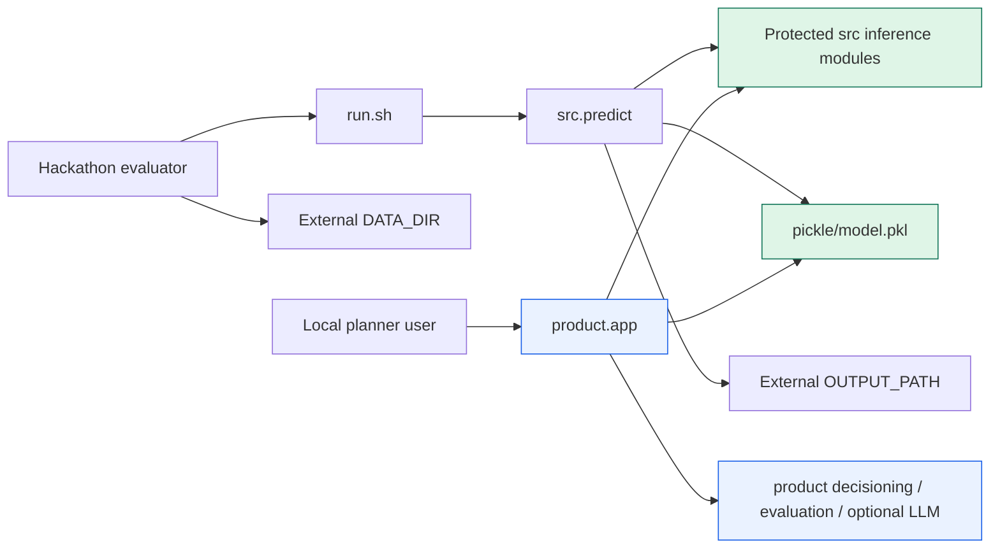

# Submission Layer Architecture

## Decision

The repository is split into a protected offline inference layer at the repository root and an optional product layer under `product/`. The protected runner has no import path to `product/`; `product/` may import stable inference contracts from `src/`, but dependency direction is one-way.



## Updated Repository Structure

```text
.
├── run.sh                         # protected evaluator entry point
├── requirements.txt               # NumPy + Pandas only
├── src/                           # protected, inference-only Python package
│   ├── canonicalize.py
│   ├── contracts.py
│   ├── direct_model.py            # serialized-model feature transform + predict
│   ├── forecast.py
│   ├── ingest.py
│   ├── model.py                   # HorizonModel inference object; no fit method
│   ├── output_adapter.py
│   ├── predict.py
│   └── validate.py
├── pickle/
│   └── model.pkl                  # pre-trained evaluator artifact
└── product/                       # never imported by run.sh
    ├── app/                       # local HTTP API, ledger, optional OpenAI evidence
    ├── frontend/                  # browser UI
    ├── decisioning/               # scenario simulator and budget optimizer
    ├── training/                  # model fitting and artifact creation
    ├── evaluation.py              # rolling-origin backtesting
    ├── scripts/                   # clean-room rehearsal and evaluation CLI
    ├── tests/
    ├── demo_data/
    ├── supplied_data/
    ├── models/                    # reports
    ├── output/                    # local outputs and decision ledger
    ├── docs/                      # plans, reports, and supplied PDFs
    └── README.md
```

Repository metadata such as `.git/` and `.gitignore` is not part of either runtime layer. The evaluator receives `DATA_DIR` and `OUTPUT_PATH` as arguments, so no sample data or output directory is required at the root.

**Local packaging caveat:** a legacy root `output/horizon_decisions.sqlite` file is currently held open by another Windows process and could not be moved safely. It is ignored by `.gitignore`, has no reference from the protected path, and must be omitted from the final repository/package after the owning process releases it. All active product output paths now resolve to `product/output/`.

## File Movement Plan Applied

| Previous location | New location | Reason |
|---|---|---|
| `app/`, `frontend/` | `product/app/`, `product/frontend/` | UI, HTTP serving, decision ledger, and optional LLM are not evaluator dependencies. |
| `src/train.py`, training code in `HorizonModel.fit`, ridge fitting functions | `product/training/` | Prevent evaluator imports from exposing a training surface. |
| `src/evaluate.py` | `product/evaluation.py` | Backtests retrain historical models and are product/release tooling. |
| `src/scenario.py`, `src/optimizer.py` | `product/decisioning/` | Scenario planning is product decision support, not required to emit scorer predictions. |
| `scripts/`, `tests/` | `product/scripts/`, `product/tests/` | Release support and regression tests remain available without expanding inference imports. |
| `data/`, `dataset/`, `models/`, `output/`, `docs/` | `product/` equivalents | Demo assets, reports, documentation, and local artifacts are not evaluator runtime inputs. |
| `.env.local` | `product/.env.local` | OpenAI credentials are physically outside the protected path. |

## Dependency Isolation Strategy

### Protected submission path

- `run.sh` requires exactly `DATA_DIR MODEL_PATH OUTPUT_PATH` and executes only `python -m src.predict`.
- `src.predict` reads CSV files, validates and canonicalizes them, unpickles `HorizonModel`, builds forecasts, validates the output contract, and atomically writes CSV.
- `src/` imports only the Python standard library, `numpy`, `pandas`, and other `src` modules.
- `requirements.txt` pins only `numpy==2.3.5` and `pandas==3.0.1`.
- `src.model.HorizonModel` has no training method. Model creation lives under `product.training`.
- The protected path has no OpenAI, HTTP, socket, URL, cloud SDK, authentication, frontend, or database imports.

### Optional product path

- Product code may import public inference primitives from `src`; `src` must never import `product`.
- `product.app.evidence` is the only path that reads `OPENAI_API_KEY` or opens an HTTPS connection.
- A missing key, quota, or network yields a deterministic evidence fallback in the product UI; it cannot affect prediction output.
- Training, evaluation, optimizer, and UI commands are explicit `python -m product...` commands, never evaluator side effects.

## Risk Analysis: Accidental Optional-Module Import

| Failure mode | Impact | Prevention | Detection |
|---|---|---|---|
| `src` imports `product.app` | Offline evaluator may load HTTP/OpenAI code or credentials. | One-way dependency rule; product is a sibling package only. | `product.scripts.rehearse_submission` scans `src/` imports and fails on product/network modules. |
| Optional dependency added to `requirements.txt` | Offline install becomes larger or fails. | Root requirements are limited to NumPy/Pandas; product uses standard-library serving. | Clean-room dependency audit compares imports against the pinned root requirements. |
| Training code is called from inference | Evaluator timeouts, data leakage, artifact mutation. | `HorizonModel.fit` and train CLI live in `product/training/`. | Rehearsal scans `src.predict` for fit/training calls and verifies pickle SHA-256 is unchanged. |
| Product API modifies shared inference output | Submission result becomes non-deterministic or partial. | `src.predict` atomically writes its own CSV and does not use product state. | Rehearsal validates CSV then confirms isolated model integrity. |
| Credential file reaches protected root | Security and accidental API dependency risk. | Local key lives only at `product/.env.local`; `.gitignore` excludes env files. | Protected-path tree check before release. |

## Verification Checklist

Run these checks immediately before submission:

```bash
# 1. Root tree contains only protected runtime assets plus product/ and metadata.
#    (First remove any ignored legacy local-output artifact.)
find . -maxdepth 1 -mindepth 1 -printf '%f\n' | sort

# 2. Protected source has no product/network/training import.
rg -n "from product|import product|openai|requests|urllib|socket|\.fit\(" src run.sh requirements.txt

# 3. Unit/regression checks remain outside evaluator invocation.
python -m unittest discover -s product/tests -q

# 4. Exact evaluator rehearsal, against a copied model and data directory.
python -m product.scripts.rehearse_submission \
  --data-dir ./product/supplied_data \
  --model ./pickle/model.pkl

# 5. Exact required evaluator command.
./run.sh DATA_DIR MODEL_PATH OUTPUT_PATH
```

On Windows, pass a Git Bash executable and a writable `--temporary-root` to the rehearsal tool. The evaluator itself should use the guide's POSIX `./run.sh` contract.

## Release Rule

Do not add an optional product import to `src/` to make a demo easier. Extend the protected path only when the scorer contract requires a deterministic inference change, and then rerun the clean-room rehearsal. When organizers publish final output columns, update only `src/contracts.py` and `src/output_adapter.py`.
